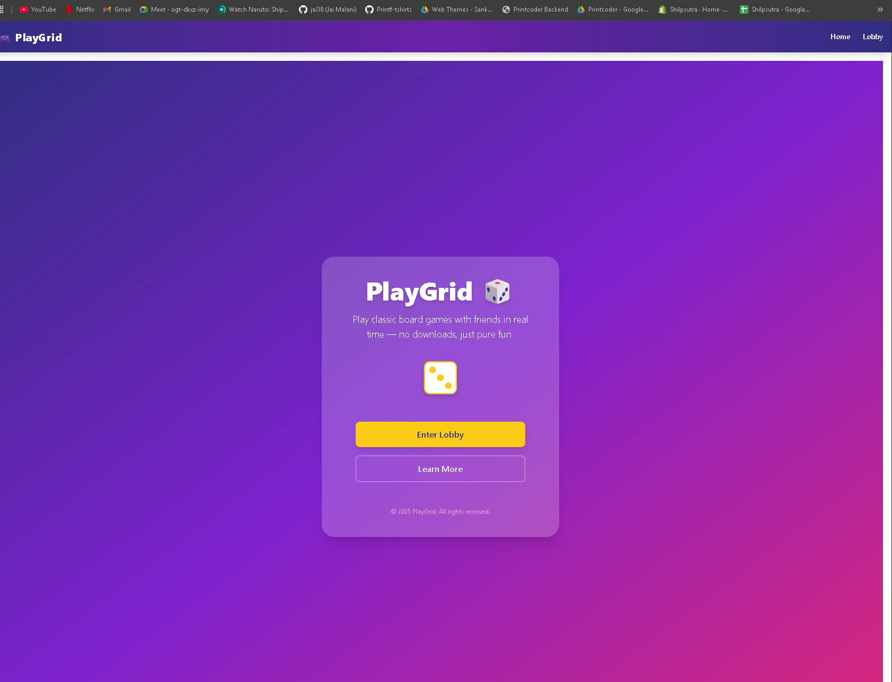

# 🎲 PlayGrid

**PlayGrid** is an open-source, real-time online multiplayer board game platform.  
Play games like Monopoly, Catan, and more — right in your browser with friends.



---

## 🚀 Features

- Real-time multiplayer via WebSockets
- Lobby system with private & public rooms
- Turn-based game engine with save/resume
- Cross-platform: Web, Mobile (PWA)
- In-game chat with emoji reactions

---

## 🛠 Tech Stack

- **Frontend:** React + TailwindCSS
- **Backend:** Node.js (Express/NestJS) + Socket.IO
- **Database:** MongoDB + Redis
- **Hosting:** AWS / Vercel / Render

---

## 📦 Installation

```bash
# Clone the repo
git clone https://github.com/PlayGridAI/PlayGrid.git
cd PlayGrid

# Start backend
cd backend
npm install
npm run dev

# Start frontend
cd frontend
npm install
npm run dev
```

---

## 🧑‍💻 Contributing

We love contributions! Please check our [CONTRIBUTING.md](CONTRIBUTING.md) for:

- How to fork & submit PRs
- Coding guidelines
- Issue & feature request process

---

## 📜 License

This project is licensed under the MIT License — see the [LICENSE](LICENSE) file for details.

---

## 🌍 Community

- 🐛 [Report Bugs](https://github.com/PlayGridAI/PlayGrid/issues)
- 💡 [Request Features](https://github.com/PlayGridAI/PlayGrid/issues)

---

**Made with ❤️ by the PlayGrid community**
