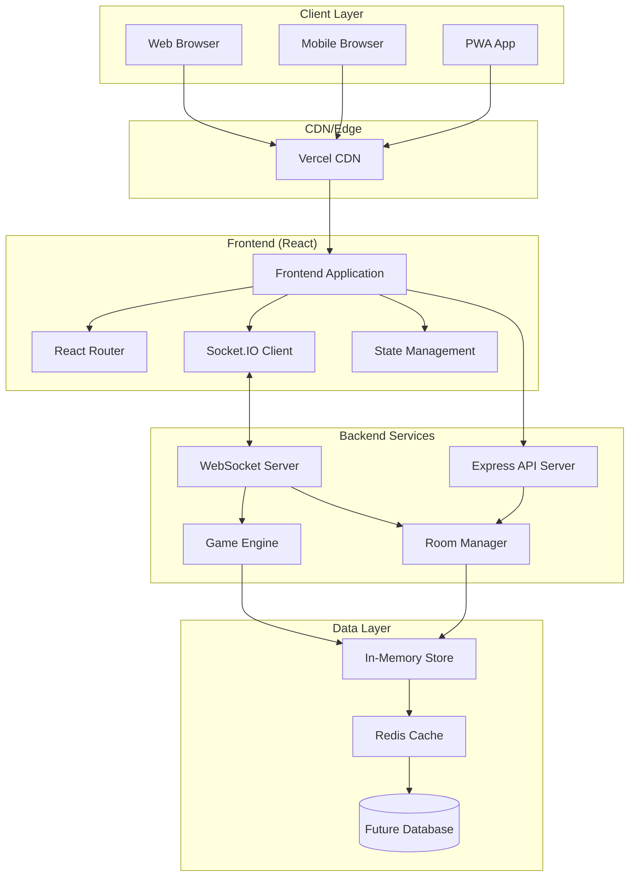
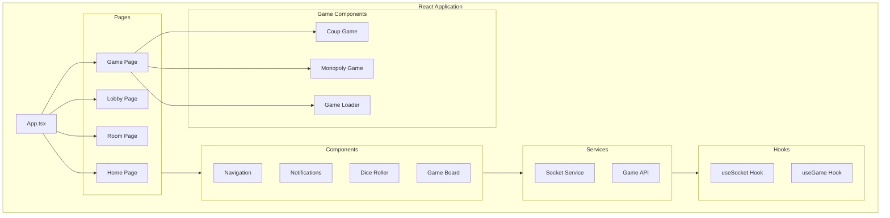
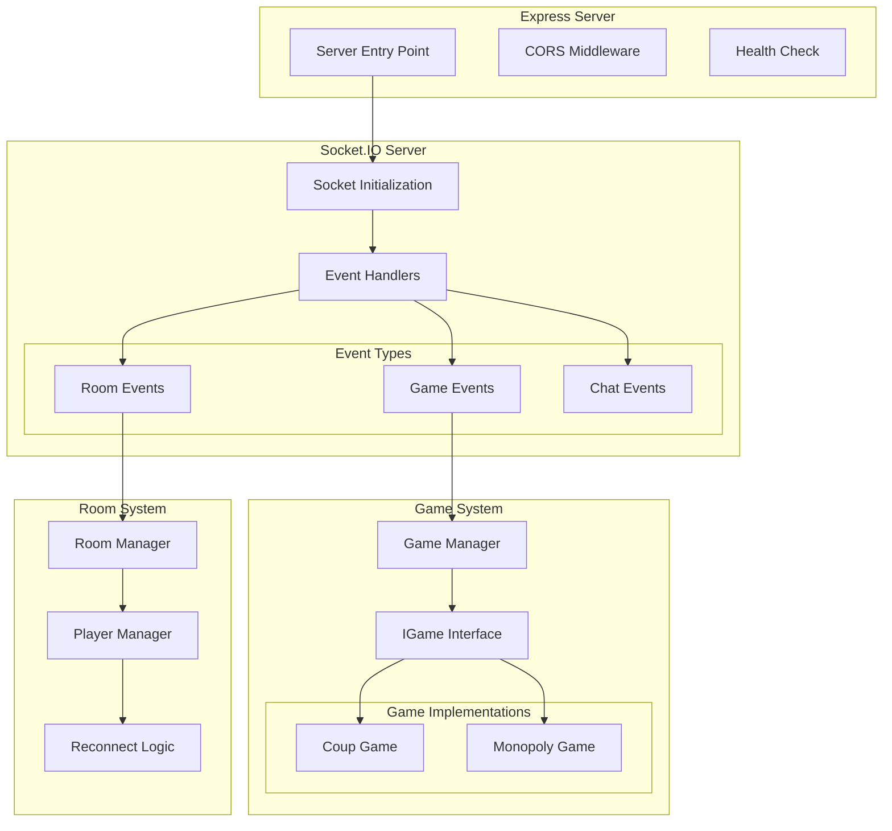
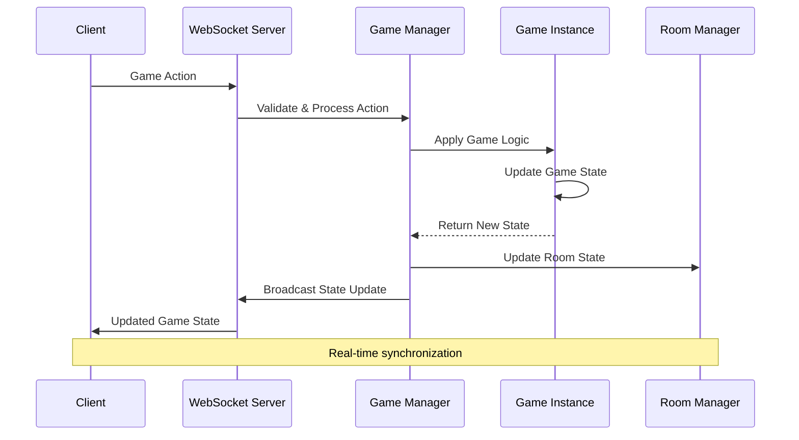
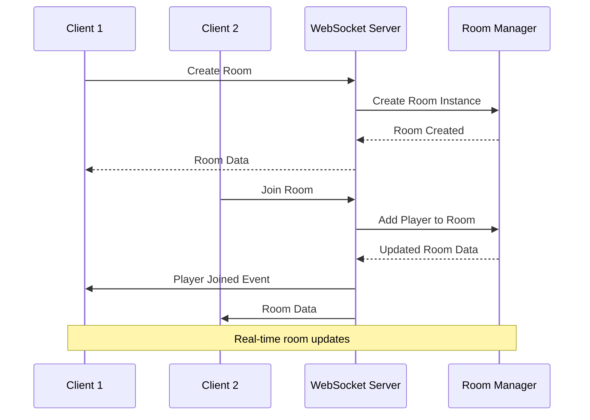
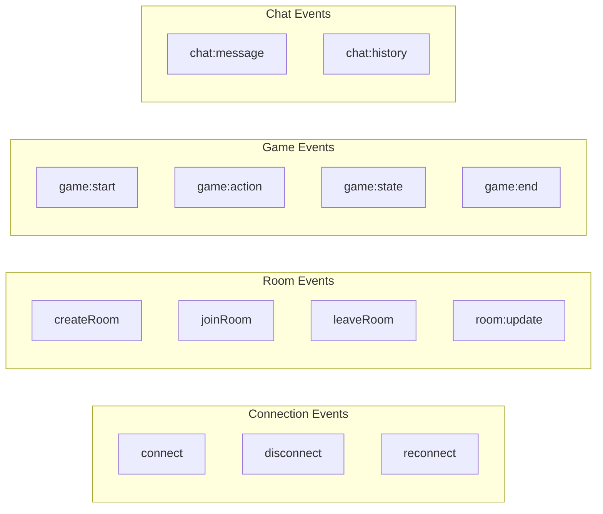
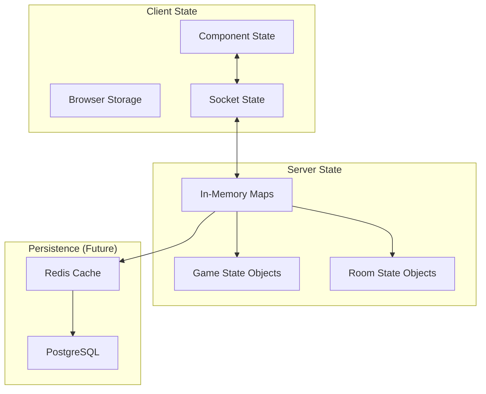
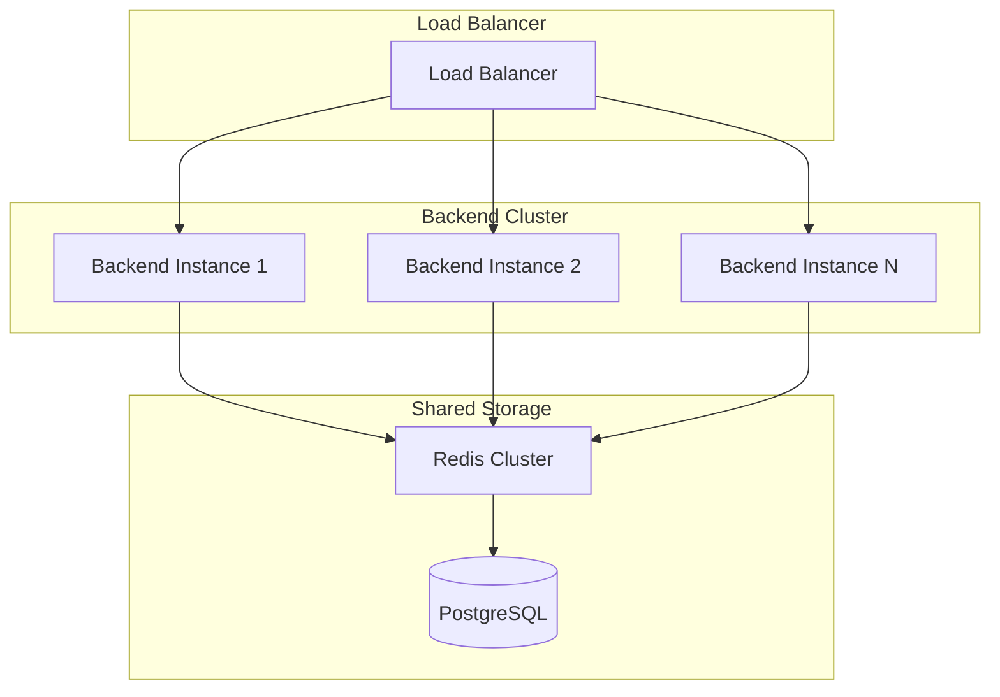

# 🏛️ PlayGrid Technical Architecture

## System Overview

PlayGrid is a modern, real-time multiplayer board game platform built with a microservices-inspired architecture. The system is designed for scalability, maintainability, and extensibility, supporting multiple games and thousands of concurrent players.

## 🏗️ High-Level Architecture



## 🧩 Component Architecture

### Frontend Architecture



### Backend Architecture



## 🔄 Data Flow Architecture

### Game State Flow



### Room Management Flow



## 📊 Component Responsibilities

### Frontend Components

| Component | Responsibility | Key Features |
|-----------|---------------|--------------|
| **App.tsx** | Main application shell | Routing, global state, error boundaries |
| **useSocket** | Socket connection management | Auto-reconnect, event subscription |
| **Room Manager** | Room UI and state | Player list, chat, game controls |
| **Game Loader** | Dynamic game loading | Game selection, initialization |
| **Game Components** | Game-specific UI | Game boards, actions, modals |

### Backend Components

| Component | Responsibility | Key Features |
|-----------|---------------|--------------|
| **Socket Server** | Real-time communication | Event handling, broadcasting |
| **Game Manager** | Game orchestration | Game lifecycle, state management |
| **Room Manager** | Room lifecycle | Creation, joining, cleanup |
| **Game Instances** | Game logic implementation | Rules, validation, state updates |
| **Player Manager** | Player state tracking | Authentication, reconnection |

## 🔌 Event Architecture

### Socket Event Categories



### Event Flow Patterns

**Request-Response Pattern:**
```typescript
// Client sends action
socket.emit('game:action', payload, (response) => {
  // Handle server response
});

// Server responds with acknowledgment
callback({ success: true, data: newGameState });
```

**Broadcast Pattern:**
```typescript
// Server broadcasts to all room members
io.to(roomId).emit('game:stateUpdate', gameState);
```

## 🗄️ Data Management

### State Storage Strategy



### State Synchronization

**Client State Management:**
- React useState/useReducer for UI state
- Socket.IO events for server state synchronization
- LocalStorage for persistence across browser sessions

**Server State Management:**
- In-memory Maps for fast access
- Game instance state isolation
- Cleanup routines for abandoned rooms

## 🏗️ Scalability Considerations

### Current Limitations (Phase 1)
- **Max Players per Room**: 8 (configurable)
- **Max Concurrent Rooms**: ~50 (memory limited)
- **Storage**: In-memory only
- **Single Server Instance**: No horizontal scaling

### Planned Improvements (Phase 2+)



### Performance Optimizations
- **Connection Pooling**: Efficient socket management
- **Event Batching**: Reduce unnecessary broadcasts
- **State Compression**: Minimize data transfer
- **Lazy Loading**: Dynamic game component loading

## 🔒 Security Architecture

### Authentication & Authorization
- Socket-based session management
- Room-level access control
- Rate limiting for API endpoints
- Input validation and sanitization

### Data Protection
- No persistent user data storage
- Session-based player identification
- Secure WebSocket connections (WSS in production)
- CORS configuration for API security

## 🚀 Technology Stack Details

### Frontend Stack
```typescript
{
  "framework": "React 18",
  "buildTool": "Vite 5",
  "styling": "TailwindCSS 3",
  "language": "TypeScript 5",
  "realtime": "Socket.IO Client 4",
  "routing": "React Router 7",
  "state": "React Built-in Hooks"
}
```

### Backend Stack
```typescript
{
  "runtime": "Node.js 20+",
  "framework": "Express 4",
  "realtime": "Socket.IO 4",
  "language": "TypeScript 5",
  "testing": "Jest",
  "validation": "Custom validators"
}
```

### Development Tools
```typescript
{
  "packageManager": "npm",
  "linting": "ESLint",
  "formatting": "Prettier",
  "bundling": "Vite (Frontend), TSC (Backend)",
  "deployment": "Vercel (Frontend), Railway/Render (Backend)"
}
```

---

**Next: [Backend Details](./backend/README.md)**
