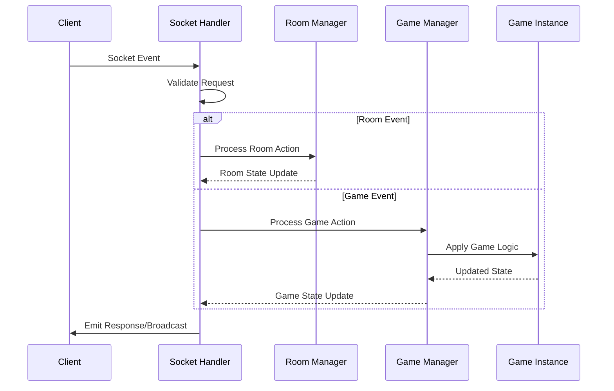

# ⚙️ Backend Architecture & Implementation

## Overview

The PlayGrid backend is a TypeScript-based Node.js application built with Express and Socket.IO, designed to handle real-time multiplayer game sessions. It follows a modular architecture with clear separation of concerns for scalability and maintainability.

## 🛠️ Technology Stack

### Core Technologies
- **Runtime**: Node.js 20+
- **Framework**: Express.js 4.x
- **Real-time Communication**: Socket.IO 4.x
- **Language**: TypeScript 5.x
- **Testing**: Jest (configured but tests need to be added)

### Dependencies
```json
{
  "dependencies": {
    "express": "^4.18.2",
    "socket.io": "^4.8.1", 
    "cors": "^2.8.5",
    "uuid": "^9.0.1"
  },
  "devDependencies": {
    "@types/express": "^4.17.17",
    "@types/cors": "^2.8.12",
    "@types/uuid": "^10.0.0",
    "typescript": "^5.1.6",
    "ts-node-dev": "^2.0.0"
  }
}
```

## 📁 Project Structure

```
backend/src/
├── server.ts              # Application entry point
├── socket.ts              # Socket.IO initialization and handlers
├── config.ts              # Configuration constants
├── rooms.ts               # Room management logic
├── games/                 # Game engine and implementations
│   ├── GameManager.ts     # Central game orchestrator
│   ├── IGame.ts          # Game interface definition
│   ├── coup/             # Coup game implementation
│   │   └── CoupGame.ts
│   └── monopoly/         # Monopoly game implementation
│       └── MonopolyGame.ts
└── utils/                # Utility functions
    └── idGenerator.ts    # ID generation utilities
```

## 🚀 Server Initialization

### Express Server Setup
```typescript
// server.ts
import express from "express";
import http from "http";
import { Server } from "socket.io";
import cors from "cors";
import { initSocket } from "./socket";
import { SERVER_PORT } from "./config";

const app = express();

// Middleware
app.use(cors({ 
  origin: "http://localhost:5173", 
  credentials: true 
}));
app.use(express.json());

// Health check endpoint
app.get("/health", (_req, res) => res.json({ status: "ok" }));

// HTTP server for Socket.IO
const httpServer = http.createServer(app);

// Socket.IO server configuration
const io = new Server(httpServer, {
    cors: {
        origin: "http://localhost:5173",
        methods: ["GET", "POST"]
    }
});

// Initialize socket handlers
initSocket(io);

// Start server
httpServer.listen(SERVER_PORT, () => {
    console.log(`PlayGrid backend running on port ${SERVER_PORT}`);
});
```

## 🔌 Socket.IO Event System

### Event Handler Architecture



### Core Event Handlers

**Connection Management:**
```typescript
// socket.ts
export function initSocket(io: Server) {
    io.on("connection", (socket: Socket) => {
        console.log(`Player connected: ${socket.id}`);
        
        // Room management events
        socket.on("createRoom", handleCreateRoom);
        socket.on("joinRoom", handleJoinRoom);
        socket.on("leaveRoom", handleLeaveRoom);
        socket.on("reconnectToRoom", handleReconnectToRoom);
        
        // Game events
        socket.on("game:start", handleGameStart);
        socket.on("game:action", handleGameAction);
        
        // Chat events
        socket.on("chat:message", handleChatMessage);
        
        // Cleanup on disconnect
        socket.on("disconnect", () => handleDisconnect(socket));
    });
}
```

### Event Payload Types

```typescript
interface CreateRoomPayload {
    roomName: string;
    isPrivate?: boolean;
    password?: string;
    playerName: string;
    maxPlayers?: number;
}

interface JoinRoomPayload {
    roomId: string;
    playerName: string;
    playerId?: string;
    password?: string;
}

interface GameActionPayload {
    roomId: string;
    gameId: string;
    action: {
        type: string;
        payload?: any;
        playerId: string;
    };
}
```

## 🏠 Room Management System

### Room Data Structure
```typescript
export type Room = {
    roomId: string;
    name: string;
    isPrivate: boolean;
    password?: string | null;
    players: Player[];
    maxPlayers: number;
    createdAt: number;
    game?: Game;
};

export type Player = {
    playerId: string;    // Stable ID across reconnects
    socketId?: string;   // Current socket ID
    name: string;
    isHost: boolean;
    lastSeen: number;
    disconnectedTimer?: NodeJS.Timeout | null;
};
```

### Room Operations

**Creating Rooms:**
```typescript
export function createRoom(
    name: string, 
    isPrivate = false, 
    password?: string | null, 
    maxPlayers = DEFAULT_MAX_PLAYERS
): Room {
    const roomId = generateId();
    const room: Room = {
        roomId,
        name,
        isPrivate,
        password: password ?? null,
        players: [],
        maxPlayers,
        createdAt: Date.now(),
        game: undefined
    };
    
    rooms.set(roomId, room);
    return room;
}
```

**Player Management:**
```typescript
export function addPlayerToRoom(
    roomId: string, 
    playerName: string, 
    socketId: string,
    playerId?: string
): { success: boolean; player?: Player; error?: string } {
    const room = rooms.get(roomId);
    if (!room) {
        return { success: false, error: "Room not found" };
    }
    
    if (room.players.length >= room.maxPlayers) {
        return { success: false, error: "Room is full" };
    }
    
    // Handle reconnection or new player
    const existingPlayer = room.players.find(p => p.playerId === playerId);
    if (existingPlayer) {
        // Reconnection
        existingPlayer.socketId = socketId;
        existingPlayer.lastSeen = Date.now();
        clearTimeout(existingPlayer.disconnectedTimer);
        return { success: true, player: existingPlayer };
    } else {
        // New player
        const newPlayer: Player = {
            playerId: playerId || generateId(),
            socketId,
            name: playerName,
            isHost: room.players.length === 0,
            lastSeen: Date.now()
        };
        room.players.push(newPlayer);
        return { success: true, player: newPlayer };
    }
}
```

### Reconnection Logic

PlayGrid supports seamless reconnection for players who lose connection:

```typescript
export function handleReconnectToRoom(
    socket: Socket, 
    { roomId, playerId, playerName }: ReconnectPayload, 
    callback: SocketAck
) {
    const room = getRoom(roomId);
    if (!room) {
        return callback({ success: false, error: "Room not found" });
    }
    
    const player = room.players.find(p => p.playerId === playerId);
    if (!player) {
        return callback({ success: false, error: "Player not found in room" });
    }
    
    // Restore connection
    player.socketId = socket.id;
    player.lastSeen = Date.now();
    
    // Clear disconnect timer
    if (player.disconnectedTimer) {
        clearTimeout(player.disconnectedTimer);
        player.disconnectedTimer = null;
    }
    
    // Join socket to room
    socket.join(roomId);
    
    // Check for active game
    const hasActiveGame = gameManager.isGameActive(roomId);
    
    callback({ 
        success: true, 
        hasActiveGame,
        room,
        player
    });
}
```

## 🎮 Game Engine Architecture

### Game Interface (IGame)

All games implement a common interface for consistency:

```typescript
export interface IGame {
    gameId: string; // e.g., "coup", "monopoly"
    
    // Initialize game state for a room
    initGame(roomId: string, players: Player[]): GameState;
    
    // Validate if an action is allowed
    validateAction(action: GameAction, state: GameState): boolean;
    
    // Apply action and return updated state
    handleAction(roomId: string, action: GameAction, state: GameState): GameState;
}

export interface GameAction {
    type: string;
    payload?: any;
    playerId: string;
}

export interface GameState {
    players: Player[];
    currentTurnPlayerId: string;
    // Game-specific state extends this
}
```

### Game Manager

The GameManager orchestrates all game instances:

```typescript
export class GameManager {
    private io: Server;
    private activeGames: Map<string, GameInstance> = new Map();
    private gameRegistry: Map<string, IGame> = new Map();
    
    constructor(io: Server) {
        this.io = io;
        this.startCleanupTimer();
        
        // Register available games
        this.registerGame(new CoupGame());
        this.registerGame(new MonopolyGame());
    }
    
    startGame(roomId: string, gameId: string, players: any[]): GameState {
        const game = this.gameRegistry.get(gameId);
        if (!game) {
            throw new Error(`Game ${gameId} not found`);
        }
        
        if (this.activeGames.has(roomId)) {
            throw new Error(`Game already active in room ${roomId}`);
        }
        
        const state = game.initGame(roomId, players);
        const gameInstance: GameInstance = {
            game,
            state,
            lastActivity: Date.now(),
            roomId
        };
        
        this.activeGames.set(roomId, gameInstance);
        return state;
    }
    
    handleAction(roomId: string, action: GameAction): GameState {
        const gameInstance = this.activeGames.get(roomId);
        if (!gameInstance) {
            throw new Error(`No active game in room ${roomId}`);
        }
        
        // Validate action
        if (!gameInstance.game.validateAction(action, gameInstance.state)) {
            throw new Error(`Invalid action: ${action.type}`);
        }
        
        // Apply action
        gameInstance.state = gameInstance.game.handleAction(
            roomId, 
            action, 
            gameInstance.state
        );
        gameInstance.lastActivity = Date.now();
        
        return gameInstance.state;
    }
}
```

## 🃏 Game Implementation Example: Coup

### Coup Game State
```typescript
interface CoupGameState extends GameState {
    players: CoupPlayer[];
    deck: CoupCard[];
    treasury: number;
    currentTurnPlayerId: string;
    pendingAction?: PendingAction;
    gamePhase: "PLAYING" | "GAME_OVER";
    winner?: string;
}

interface CoupPlayer {
    playerId: string;
    name: string;
    coins: number;
    influence: CoupCard[];
    revealedCards: CoupCard[];
    isAlive: boolean;
}

type CoupCard = "Duke" | "Assassin" | "Captain" | "Ambassador" | "Contessa";
```

### Game Action Handling
```typescript
export class CoupGame implements IGame {
    gameId = "coup";
    
    handleAction(roomId: string, action: GameAction, state: CoupGameState): CoupGameState {
        const player = state.players.find(p => p.playerId === action.playerId);
        if (!player || !player.isAlive) return state;
        
        switch (action.type) {
            case "INCOME":
                player.coins += 1;
                this.advanceTurn(state);
                break;
                
            case "FOREIGN_AID":
                // Can be blocked by Duke
                state.pendingAction = { 
                    type: "FOREIGN_AID", 
                    fromPlayerId: player.playerId 
                };
                break;
                
            case "COUP":
                if (player.coins < 7) return state;
                player.coins -= 7;
                this.loseInfluence(state, action.payload.targetId);
                this.advanceTurn(state);
                break;
                
            case "CHALLENGE":
                this.resolveChallenge(
                    state, 
                    action.payload.claimedPlayerId, 
                    action.playerId
                );
                break;
                
            // ... other actions
        }
        
        this.checkWinner(state);
        return state;
    }
    
    private resolveChallenge(
        state: CoupGameState, 
        claimedPlayerId: string, 
        challengerId: string
    ) {
        const claimedPlayer = state.players.find(p => p.playerId === claimedPlayerId);
        const challenger = state.players.find(p => p.playerId === challengerId);
        
        if (!claimedPlayer || !challenger) return;
        
        const pendingType = state.pendingAction?.type;
        const requiredCard = this.getRequiredCardForAction(pendingType!);
        
        if (claimedPlayer.influence.includes(requiredCard)) {
            // Challenge failed - challenger loses influence
            this.loseInfluence(state, challengerId);
            // Shuffle revealed card back into deck
            this.shuffleCardBackIntoDeck(state, claimedPlayer, requiredCard);
        } else {
            // Challenge succeeded - claimed player loses influence
            this.loseInfluence(state, claimedPlayerId);
        }
        
        state.pendingAction = undefined;
    }
}
```

## 📊 State Management Strategy

### In-Memory Storage
- **Rooms**: `Map<string, Room>` - Fast O(1) access
- **Games**: `Map<string, GameInstance>` - Isolated game states
- **Players**: Embedded in room objects with disconnect timers

### State Cleanup
```typescript
// Automatic cleanup of abandoned rooms and games
private startCleanupTimer() {
    setInterval(() => {
        const now = Date.now();
        
        // Clean up inactive games
        for (const [roomId, gameInstance] of this.activeGames) {
            if (now - gameInstance.lastActivity > this.GAME_TIMEOUT) {
                this.endGame(roomId);
                console.log(`Cleaned up inactive game in room ${roomId}`);
            }
        }
        
        // Clean up empty rooms
        for (const [roomId, room] of rooms) {
            if (room.players.length === 0 && 
                now - room.createdAt > ROOM_TIMEOUT) {
                rooms.delete(roomId);
                console.log(`Cleaned up empty room ${roomId}`);
            }
        }
    }, this.CLEANUP_INTERVAL);
}
```

## 🔒 Security & Validation

### Input Validation
```typescript
function validateGameAction(action: GameAction): boolean {
    if (!action.type || typeof action.type !== 'string') return false;
    if (!action.playerId || typeof action.playerId !== 'string') return false;
    
    // Action-specific validation
    switch (action.type) {
        case "COUP":
            return action.payload?.targetId && 
                   typeof action.payload.targetId === 'string';
        case "CHALLENGE":
            return action.payload?.claimedPlayerId &&
                   typeof action.payload.claimedPlayerId === 'string';
        default:
            return true;
    }
}
```

### Rate Limiting
```typescript
const actionCooldowns = new Map<string, number>();

function rateLimitAction(playerId: string): boolean {
    const now = Date.now();
    const lastAction = actionCooldowns.get(playerId) || 0;
    
    if (now - lastAction < ACTION_COOLDOWN_MS) {
        return false; // Rate limited
    }
    
    actionCooldowns.set(playerId, now);
    return true;
}
```

## 🔧 Configuration

### Environment Variables
```typescript
// config.ts
export const SERVER_PORT = process.env.PORT || 4000;
export const CORS_ORIGIN = process.env.CORS_ORIGIN || "http://localhost:5173";
export const DEFAULT_MAX_PLAYERS = 8;
export const ROOM_DISCONNECT_GRACE_MS = 5 * 60 * 1000; // 5 minutes
export const GAME_TIMEOUT_MS = 30 * 60 * 1000; // 30 minutes
```

### Development Scripts
```json
{
  "scripts": {
    "dev": "ts-node-dev --respawn --transpile-only src/server.ts",
    "build": "tsc -p .",
    "start": "node dist/server.js",
    "test": "jest"
  }
}
```

## 🧪 Testing Strategy

### Unit Testing Structure (Planned)
```typescript
// Example test structure for GameManager
describe('GameManager', () => {
    let gameManager: GameManager;
    let mockIO: Server;
    
    beforeEach(() => {
        mockIO = new Server();
        gameManager = new GameManager(mockIO);
    });
    
    describe('startGame', () => {
        it('should create new game instance', () => {
            const players = [
                { playerId: '1', name: 'Player 1' },
                { playerId: '2', name: 'Player 2' }
            ];
            
            const state = gameManager.startGame('room1', 'coup', players);
            
            expect(state).toBeDefined();
            expect(state.players).toHaveLength(2);
        });
    });
});
```

---

**Next: [Frontend Details](../frontend/README.md)**