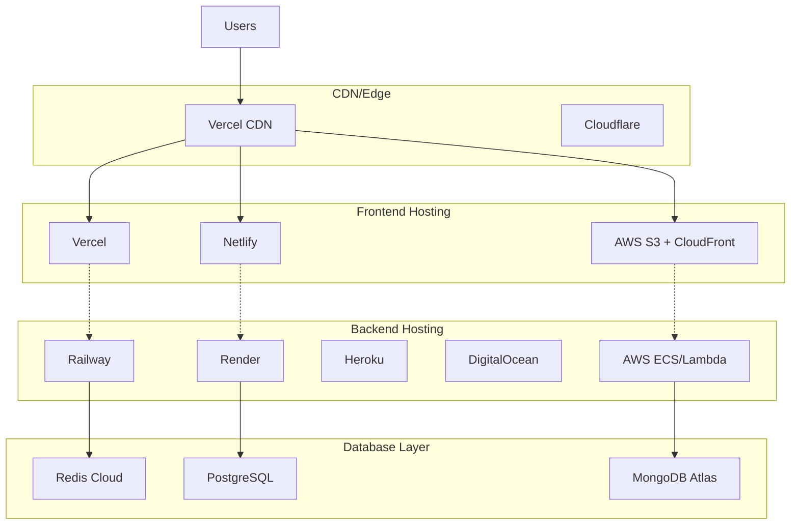

# 🚀 PlayGrid Deployment Guide

## Deployment Overview

PlayGrid uses a microservices architecture that can be deployed across multiple platforms. This guide covers deployment strategies for different environments, from simple shared hosting to enterprise-grade cloud infrastructure.

## 🏗️ Deployment Architecture



---

## 🎯 Quick Deploy (Recommended)

### Frontend: Vercel Deployment

**1. Install Vercel CLI:**
```bash
npm install -g vercel
```

**2. Deploy Frontend:**
```bash
cd frontend
vercel

# Follow prompts:
# ? Set up and deploy "frontend"? Y
# ? Which scope? [your-username]
# ? Link to existing project? N
# ? What's your project's name? playgrid-frontend
# ? In which directory is your code located? ./
```

**3. Configure Environment Variables:**
In Vercel dashboard, add environment variables:
```ini
VITE_API_URL=https://your-backend-domain.com
VITE_SOCKET_URL=https://your-backend-domain.com
VITE_APP_NAME=PlayGrid
```

**4. Set Custom Domain (Optional):**
```bash
vercel domains add playgrid.app
vercel alias [deployment-url] playgrid.app
```

### Backend: Railway Deployment

**1. Install Railway CLI:**
```bash
npm install -g @railway/cli
railway login
```

**2. Deploy Backend:**
```bash
cd backend
railway deploy

# Or connect GitHub repository
railway connect
```

**3. Configure Environment Variables:**
```bash
railway variables set PORT=4000
railway variables set NODE_ENV=production
railway variables set CORS_ORIGIN=https://your-frontend-domain.com
```

**4. Custom Domain:**
```bash
railway domain add api.playgrid.app
```

---

## 🔧 Platform-Specific Deployment

### Vercel (Frontend)

**vercel.json configuration:**
```json
{
  "version": 2,
  "builds": [
    {
      "src": "package.json",
      "use": "@vercel/static-build",
      "config": {
        "distDir": "dist"
      }
    }
  ],
  "routes": [
    {
      "src": "/(.*)",
      "dest": "/index.html"
    }
  ],
  "env": {
    "VITE_API_URL": "@api_url",
    "VITE_SOCKET_URL": "@socket_url"
  },
  "build": {
    "env": {
      "VITE_API_URL": "@api_url",
      "VITE_SOCKET_URL": "@socket_url"
    }
  }
}
```

**Build command configuration:**
```json
{
  "scripts": {
    "build": "vite build",
    "vercel-build": "npm run build"
  }
}
```

### Netlify (Frontend Alternative)

**netlify.toml configuration:**
```toml
[build]
  command = "npm run build"
  publish = "dist"

[build.environment]
  NODE_VERSION = "20"

[[redirects]]
  from = "/*"
  to = "/index.html"
  status = 200

[context.production.environment]
  VITE_API_URL = "https://api.playgrid.app"
  VITE_SOCKET_URL = "https://api.playgrid.app"

[context.deploy-preview.environment]
  VITE_API_URL = "https://staging-api.playgrid.app"
  VITE_SOCKET_URL = "https://staging-api.playgrid.app"
```

### Railway (Backend)

**railway.json:**
```json
{
  "$schema": "https://railway.app/railway.schema.json",
  "build": {
    "builder": "NIXPACKS"
  },
  "deploy": {
    "startCommand": "npm start",
    "healthcheckPath": "/health",
    "healthcheckTimeout": 300,
    "restartPolicyType": "ON_FAILURE",
    "restartPolicyMaxRetries": 10
  }
}
```

**Dockerfile (optional):**
```dockerfile
FROM node:20-alpine AS builder

WORKDIR /app
COPY package*.json ./
RUN npm ci --only=production

FROM node:20-alpine AS runtime

WORKDIR /app
COPY --from=builder /app/node_modules ./node_modules
COPY . .

RUN npm run build

EXPOSE 4000

HEALTHCHECK --interval=30s --timeout=3s --start-period=5s --retries=3 \
  CMD curl -f http://localhost:4000/health || exit 1

CMD ["npm", "start"]
```

### Render (Backend Alternative)

**render.yaml:**
```yaml
services:
  - type: web
    name: playgrid-backend
    env: node
    plan: starter
    buildCommand: npm ci && npm run build
    startCommand: npm start
    healthCheckPath: /health
    envVars:
      - key: NODE_ENV
        value: production
      - key: PORT
        value: 4000
      - key: CORS_ORIGIN
        fromService:
          type: web
          name: playgrid-frontend
          property: host
    autoDeploy: false
```

### Heroku (Backend Alternative)

**Procfile:**
```
web: npm start
```

**heroku.yml:**
```yaml
build:
  docker:
    web: Dockerfile
run:
  web: npm start
```

**Deploy commands:**
```bash
# Install Heroku CLI
heroku login

# Create app
heroku create playgrid-backend

# Set environment variables
heroku config:set NODE_ENV=production
heroku config:set CORS_ORIGIN=https://playgrid.app

# Deploy
git push heroku main

# Scale dynos
heroku ps:scale web=1
```

---

## ☁️ AWS Deployment (Advanced)

### Frontend: S3 + CloudFront

**1. Build and upload to S3:**
```bash
# Build application
npm run build

# Sync to S3 bucket
aws s3 sync dist/ s3://playgrid-frontend --delete

# Invalidate CloudFront cache
aws cloudfront create-invalidation --distribution-id E123456789 --paths "/*"
```

**2. CloudFormation template:**
```yaml
AWSTemplateFormatVersion: '2010-09-09'
Resources:
  S3Bucket:
    Type: AWS::S3::Bucket
    Properties:
      BucketName: playgrid-frontend
      WebsiteConfiguration:
        IndexDocument: index.html
        ErrorDocument: index.html
      PublicAccessBlockConfiguration:
        BlockPublicAcls: false
        BlockPublicPolicy: false
        IgnorePublicAcls: false
        RestrictPublicBuckets: false

  CloudFrontDistribution:
    Type: AWS::CloudFront::Distribution
    Properties:
      DistributionConfig:
        Origins:
          - DomainName: !GetAtt S3Bucket.RegionalDomainName
            Id: S3Origin
            S3OriginConfig:
              OriginAccessIdentity: ''
        DefaultCacheBehavior:
          TargetOriginId: S3Origin
          ViewerProtocolPolicy: redirect-to-https
          AllowedMethods: [GET, HEAD]
          CachedMethods: [GET, HEAD]
          Compress: true
        Enabled: true
        DefaultRootObject: index.html
        CustomErrorResponses:
          - ErrorCode: 404
            ResponseCode: 200
            ResponsePagePath: /index.html
```

### Backend: ECS Fargate

**1. Dockerfile for production:**
```dockerfile
FROM node:20-alpine AS builder

WORKDIR /app
COPY package*.json ./
RUN npm ci --only=production

FROM node:20-alpine AS runtime

RUN addgroup -g 1001 -S nodejs
RUN adduser -S playgrid -u 1001

WORKDIR /app

COPY --from=builder --chown=playgrid:nodejs /app/node_modules ./node_modules
COPY --chown=playgrid:nodejs . .

RUN npm run build

USER playgrid

EXPOSE 4000

HEALTHCHECK --interval=30s --timeout=3s --start-period=5s --retries=3 \
  CMD curl -f http://localhost:4000/health || exit 1

CMD ["npm", "start"]
```

**2. ECS Task Definition:**
```json
{
  "family": "playgrid-backend",
  "networkMode": "awsvpc",
  "requiresCompatibilities": ["FARGATE"],
  "cpu": "256",
  "memory": "512",
  "executionRoleArn": "arn:aws:iam::123456789:role/ecsTaskExecutionRole",
  "containerDefinitions": [
    {
      "name": "playgrid-backend",
      "image": "123456789.dkr.ecr.us-east-1.amazonaws.com/playgrid-backend:latest",
      "portMappings": [
        {
          "containerPort": 4000,
          "protocol": "tcp"
        }
      ],
      "environment": [
        {
          "name": "NODE_ENV",
          "value": "production"
        },
        {
          "name": "PORT",
          "value": "4000"
        }
      ],
      "healthCheck": {
        "command": ["CMD-SHELL", "curl -f http://localhost:4000/health || exit 1"],
        "interval": 30,
        "timeout": 5,
        "retries": 3,
        "startPeriod": 60
      },
      "logConfiguration": {
        "logDriver": "awslogs",
        "options": {
          "awslogs-group": "/ecs/playgrid-backend",
          "awslogs-region": "us-east-1",
          "awslogs-stream-prefix": "ecs"
        }
      }
    }
  ]
}
```

---

## 🐳 Docker Deployment

### Production Docker Compose

**docker-compose.prod.yml:**
```yaml
version: '3.8'

services:
  frontend:
    build:
      context: ./frontend
      dockerfile: Dockerfile.prod
    ports:
      - "80:80"
    environment:
      - VITE_API_URL=https://api.playgrid.app
      - VITE_SOCKET_URL=https://api.playgrid.app
    restart: unless-stopped

  backend:
    build:
      context: ./backend
      dockerfile: Dockerfile.prod
    ports:
      - "4000:4000"
    environment:
      - NODE_ENV=production
      - PORT=4000
      - CORS_ORIGIN=https://playgrid.app
      - REDIS_URL=redis://redis:6379
    depends_on:
      - redis
    restart: unless-stopped
    healthcheck:
      test: ["CMD", "curl", "-f", "http://localhost:4000/health"]
      interval: 30s
      timeout: 10s
      retries: 3

  redis:
    image: redis:7-alpine
    volumes:
      - redis_data:/data
    restart: unless-stopped
    healthcheck:
      test: ["CMD", "redis-cli", "ping"]
      interval: 30s
      timeout: 10s
      retries: 3

  nginx:
    image: nginx:alpine
    ports:
      - "443:443"
    volumes:
      - ./nginx.conf:/etc/nginx/nginx.conf
      - ./ssl:/etc/nginx/ssl
    depends_on:
      - frontend
      - backend
    restart: unless-stopped

volumes:
  redis_data:
```

**Frontend Production Dockerfile:**
```dockerfile
# Build stage
FROM node:20-alpine AS builder

WORKDIR /app
COPY package*.json ./
RUN npm ci

COPY . .
RUN npm run build

# Production stage
FROM nginx:alpine

COPY --from=builder /app/dist /usr/share/nginx/html
COPY nginx.conf /etc/nginx/nginx.conf

EXPOSE 80

CMD ["nginx", "-g", "daemon off;"]
```

### Kubernetes Deployment

**k8s/namespace.yaml:**
```yaml
apiVersion: v1
kind: Namespace
metadata:
  name: playgrid
```

**k8s/backend-deployment.yaml:**
```yaml
apiVersion: apps/v1
kind: Deployment
metadata:
  name: playgrid-backend
  namespace: playgrid
spec:
  replicas: 3
  selector:
    matchLabels:
      app: playgrid-backend
  template:
    metadata:
      labels:
        app: playgrid-backend
    spec:
      containers:
      - name: backend
        image: playgrid/backend:latest
        ports:
        - containerPort: 4000
        env:
        - name: NODE_ENV
          value: "production"
        - name: PORT
          value: "4000"
        - name: REDIS_URL
          valueFrom:
            secretKeyRef:
              name: playgrid-secrets
              key: redis-url
        resources:
          requests:
            memory: "256Mi"
            cpu: "250m"
          limits:
            memory: "512Mi"
            cpu: "500m"
        livenessProbe:
          httpGet:
            path: /health
            port: 4000
          initialDelaySeconds: 30
          periodSeconds: 30
        readinessProbe:
          httpGet:
            path: /health
            port: 4000
          initialDelaySeconds: 5
          periodSeconds: 5

---
apiVersion: v1
kind: Service
metadata:
  name: playgrid-backend-service
  namespace: playgrid
spec:
  selector:
    app: playgrid-backend
  ports:
  - protocol: TCP
    port: 80
    targetPort: 4000
  type: ClusterIP
```

---

## 📊 Monitoring & Health Checks

### Application Health Checks

**Backend health endpoint enhancement:**
```typescript
// backend/src/health.ts
import { Request, Response } from 'express';

interface HealthStatus {
  status: 'ok' | 'error';
  timestamp: string;
  uptime: number;
  version: string;
  environment: string;
  services: {
    database: 'connected' | 'disconnected';
    redis: 'connected' | 'disconnected';
    socketio: 'active' | 'inactive';
  };
  metrics: {
    activeRooms: number;
    activeGames: number;
    connectedPlayers: number;
    memoryUsage: NodeJS.MemoryUsage;
  };
}

export function healthCheck(req: Request, res: Response) {
  const health: HealthStatus = {
    status: 'ok',
    timestamp: new Date().toISOString(),
    uptime: process.uptime(),
    version: process.env.npm_package_version || '1.0.0',
    environment: process.env.NODE_ENV || 'development',
    services: {
      database: 'connected', // Check actual database connection
      redis: 'connected',     // Check Redis connection
      socketio: 'active'      // Check Socket.IO status
    },
    metrics: {
      activeRooms: getAllRooms().length,
      activeGames: getActiveGamesCount(),
      connectedPlayers: getConnectedPlayersCount(),
      memoryUsage: process.memoryUsage()
    }
  };

  res.status(200).json(health);
}
```

### Prometheus Metrics

**metrics.ts:**
```typescript
import { Request, Response, NextFunction } from 'express';

// Metrics collection
const metrics = {
  httpRequests: new Map<string, number>(),
  socketConnections: 0,
  activeRooms: 0,
  activeGames: 0,
  errors: new Map<string, number>()
};

export function metricsMiddleware(req: Request, res: Response, next: NextFunction) {
  const start = Date.now();
  
  res.on('finish', () => {
    const duration = Date.now() - start;
    const route = `${req.method} ${req.route?.path || req.path}`;
    
    metrics.httpRequests.set(route, (metrics.httpRequests.get(route) || 0) + 1);
  });
  
  next();
}

export function getMetrics(req: Request, res: Response) {
  const output = [];
  
  // HTTP request metrics
  for (const [route, count] of metrics.httpRequests) {
    output.push(`http_requests_total{route="${route}"} ${count}`);
  }
  
  // Socket metrics
  output.push(`socket_connections_total ${metrics.socketConnections}`);
  output.push(`active_rooms_total ${metrics.activeRooms}`);
  output.push(`active_games_total ${metrics.activeGames}`);
  
  // Memory metrics
  const memory = process.memoryUsage();
  output.push(`nodejs_memory_usage_bytes{type="rss"} ${memory.rss}`);
  output.push(`nodejs_memory_usage_bytes{type="heapUsed"} ${memory.heapUsed}`);
  output.push(`nodejs_memory_usage_bytes{type="heapTotal"} ${memory.heapTotal}`);
  
  res.set('Content-Type', 'text/plain');
  res.send(output.join('\n'));
}
```

---

## 🔐 Security Configuration

### SSL/TLS Setup

**Let's Encrypt with Nginx:**
```nginx
server {
    listen 80;
    server_name api.playgrid.app;
    return 301 https://$server_name$request_uri;
}

server {
    listen 443 ssl http2;
    server_name api.playgrid.app;
    
    ssl_certificate /etc/letsencrypt/live/api.playgrid.app/fullchain.pem;
    ssl_certificate_key /etc/letsencrypt/live/api.playgrid.app/privkey.pem;
    
    ssl_protocols TLSv1.2 TLSv1.3;
    ssl_ciphers ECDHE-RSA-AES256-GCM-SHA512:DHE-RSA-AES256-GCM-SHA512;
    ssl_prefer_server_ciphers off;
    
    location / {
        proxy_pass http://localhost:4000;
        proxy_http_version 1.1;
        proxy_set_header Upgrade $http_upgrade;
        proxy_set_header Connection 'upgrade';
        proxy_set_header Host $host;
        proxy_set_header X-Real-IP $remote_addr;
        proxy_set_header X-Forwarded-For $proxy_add_x_forwarded_for;
        proxy_set_header X-Forwarded-Proto $scheme;
        proxy_cache_bypass $http_upgrade;
    }
}
```

### Environment Secrets Management

**Using AWS Secrets Manager:**
```typescript
import { SecretsManagerClient, GetSecretValueCommand } from "@aws-sdk/client-secrets-manager";

async function getSecret(secretName: string): Promise<string> {
  const client = new SecretsManagerClient({ region: "us-east-1" });
  
  try {
    const response = await client.send(
      new GetSecretValueCommand({ SecretId: secretName })
    );
    return response.SecretString || '';
  } catch (error) {
    console.error(`Error retrieving secret ${secretName}:`, error);
    throw error;
  }
}

// Usage
const dbPassword = await getSecret("playgrid/database/password");
const redisUrl = await getSecret("playgrid/redis/url");
```

---

## 📈 Scaling Strategies

### Horizontal Scaling

**Load Balancer Configuration:**
```yaml
apiVersion: v1
kind: Service
metadata:
  name: playgrid-backend-lb
  namespace: playgrid
spec:
  type: LoadBalancer
  selector:
    app: playgrid-backend
  ports:
  - port: 80
    targetPort: 4000
  sessionAffinity: ClientIP  # Important for Socket.IO
```

**Redis for Session Storage:**
```typescript
// Sticky sessions with Redis
import { createAdapter } from "@socket.io/redis-adapter";
import { createClient } from "redis";

const pubClient = createClient({ url: process.env.REDIS_URL });
const subClient = pubClient.duplicate();

await Promise.all([pubClient.connect(), subClient.connect()]);

io.adapter(createAdapter(pubClient, subClient));
```

### Database Scaling

**Read Replicas Setup:**
```typescript
// Database connection with read replicas
const dbConfig = {
  write: {
    host: 'postgres-primary.example.com',
    port: 5432,
    database: 'playgrid',
    username: 'playgrid_write',
    password: process.env.DB_WRITE_PASSWORD
  },
  read: [
    {
      host: 'postgres-replica-1.example.com',
      port: 5432,
      database: 'playgrid',
      username: 'playgrid_read',
      password: process.env.DB_READ_PASSWORD
    },
    {
      host: 'postgres-replica-2.example.com',
      port: 5432,
      database: 'playgrid',
      username: 'playgrid_read',
      password: process.env.DB_READ_PASSWORD
    }
  ]
};
```

---

## 🚨 Backup & Disaster Recovery

### Automated Backups

**Database Backup Script:**
```bash
#!/bin/bash

# PostgreSQL backup
BACKUP_DIR="/backups/$(date +%Y-%m-%d)"
mkdir -p $BACKUP_DIR

pg_dump -h $DB_HOST -U $DB_USER -d playgrid \
  --no-password --clean --create --if-exists \
  --file="$BACKUP_DIR/playgrid_$(date +%H%M).sql"

# Upload to S3
aws s3 cp $BACKUP_DIR s3://playgrid-backups/$(date +%Y-%m-%d)/ --recursive

# Cleanup old backups (keep 30 days)
find /backups -type d -mtime +30 -exec rm -rf {} \;
```

**Redis Backup:**
```bash
#!/bin/bash

# Redis backup
redis-cli --rdb /backups/redis/dump_$(date +%Y%m%d_%H%M).rdb

# Upload to S3
aws s3 cp /backups/redis/ s3://playgrid-backups/redis/ --recursive
```

---

**Next: [Testing Strategy](../testing/README.md)**