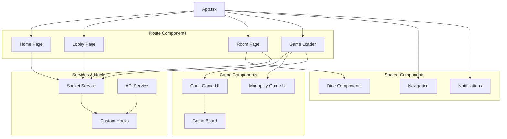

# 🎨 Frontend Architecture & Implementation

## Overview

The PlayGrid frontend is a modern React application built with TypeScript, Vite, and TailwindCSS. It provides a responsive, real-time user interface for multiplayer board games with seamless WebSocket integration for live gameplay.

## 🛠️ Technology Stack

### Core Technologies
- **Framework**: React 18.x
- **Build Tool**: Vite 5.x
- **Styling**: TailwindCSS 3.x
- **Language**: TypeScript 5.x
- **Real-time**: Socket.IO Client 4.x
- **Routing**: React Router 7.x

### Dependencies
```json
{
  "dependencies": {
    "react": "^18.3.1",
    "react-dom": "^18.3.1",
    "react-router-dom": "^7.8.0",
    "socket.io-client": "^4.8.1",
    "@react-three/fiber": "^8.15.16",
    "@react-three/drei": "^9.122.0",
    "three": "^0.179.1",
    "axios": "^1.11.0"
  },
  "devDependencies": {
    "@vitejs/plugin-react": "^4.3.1",
    "tailwindcss": "^3.4.10",
    "typescript": "^5.5.4",
    "vite": "^5.4.1"
  }
}
```

## 📁 Project Structure

```
frontend/src/
├── main.tsx               # Application entry point
├── App.tsx                # Main app component with routing
├── pages/                 # Page components
│   ├── Home.tsx          # Landing page
│   ├── Lobby.tsx         # Room browser
│   ├── Room.tsx          # Room waiting area
│   ├── GameLoader.tsx    # Game initialization
│   └── NotFound.tsx      # 404 page
├── components/           # Reusable UI components
│   ├── Navbar.tsx        # Navigation header
│   ├── Toast.tsx         # Notifications
│   ├── DiceRoller.tsx    # Dice animation component
│   └── DiceFace.tsx      # Individual dice face
├── games/                # Game-specific components
│   ├── coup/             # Coup game UI
│   └── monopoly/         # Monopoly game UI
├── services/             # API and external services
│   ├── socket.ts         # Socket.IO service layer
│   └── api.ts            # HTTP API calls
├── hooks/                # Custom React hooks
│   ├── useSocket.ts      # Socket connection hook
│   └── useGameValidation.ts # Game validation hook
└── assets/               # Static assets
    └── images/
```

## 🚀 Application Architecture

### Component Hierarchy



### State Management Strategy

**Local Component State:**
```typescript
// React built-in state management
const [gameState, setGameState] = useState<GameState | null>(null);
const [players, setPlayers] = useState<Player[]>([]);
const [currentPlayer, setCurrentPlayer] = useState<Player | null>(null);
const [error, setError] = useState<string>("");
```

**Persistent State (LocalStorage):**
```typescript
// Persistent state for reconnection
localStorage.setItem("playerName", playerName);
localStorage.setItem("roomId", roomId);
localStorage.setItem("currentPlayer", JSON.stringify(player));
localStorage.setItem("currentRoom", JSON.stringify(room));
```

**Real-time State (Socket Events):**
```typescript
// Socket-driven state updates
socket.on("room:joined", ({ room, player }) => {
    setCurrentPlayer(player);
    setRoom(room);
    setPlayers(room.players);
});

socket.on("game:stateUpdate", (newGameState) => {
    setGameState(newGameState);
});
```

## 🔌 Socket.IO Integration

### Custom useSocket Hook

The `useSocket` hook provides centralized socket management:

```typescript
// hooks/useSocket.ts
import { useEffect, useRef } from 'react';
import { io, Socket } from 'socket.io-client';

type SocketEventHandler = (socket: Socket) => void;

export function useSocket(setupEvents: SocketEventHandler): Socket | null {
    const socketRef = useRef<Socket | null>(null);
    
    useEffect(() => {
        // Create socket connection
        socketRef.current = io('http://localhost:4000', {
            transports: ['websocket'],
            upgrade: true,
        });
        
        const socket = socketRef.current;
        
        // Setup event listeners
        setupEvents(socket);
        
        // Connection status logging
        socket.on('connect', () => {
            console.log('Connected to server:', socket.id);
        });
        
        socket.on('disconnect', () => {
            console.log('Disconnected from server');
        });
        
        // Cleanup on unmount
        return () => {
            socket.disconnect();
        };
    }, []);
    
    return socketRef.current;
}
```

### Socket Service Layer

The socket service provides a clean API for socket operations:

```typescript
// services/socket.ts
import { io, Socket } from 'socket.io-client';

let socket: Socket | null = null;

export const initializeSocket = () => {
    socket = io('http://localhost:4000');
    return socket;
};

export const createRoom = (
    playerName: string, 
    roomName: string, 
    isPrivate: boolean, 
    password?: string,
    onSuccess?: (roomId: string) => void
) => {
    socket?.emit('createRoom', { 
        playerName, 
        roomName, 
        isPrivate, 
        password 
    }, (response: any) => {
        if (response.success) {
            localStorage.setItem('roomId', response.roomId);
            onSuccess?.(response.roomId);
        } else {
            console.error('Failed to create room:', response.error);
        }
    });
};

export const joinRoom = (
    roomId: string, 
    playerName: string, 
    playerId?: string,
    password?: string,
    onSuccess?: (roomId: string) => void
) => {
    socket?.emit('joinRoom', { 
        roomId, 
        playerName, 
        playerId, 
        password 
    }, (response: any) => {
        if (response.success) {
            localStorage.setItem('roomId', roomId);
            onSuccess?.(roomId);
        } else {
            console.error('Failed to join room:', response.error);
        }
    });
};
```

### Event Lifecycle Management

**Page-Level Event Setup:**
```typescript
// pages/Room.tsx
export default function Room() {
    const setupEvents = useCallback((socket: Socket) => {
        // Room events
        socket.on("room:joined", ({ room, player }) => {
            localStorage.setItem("roomId", room.roomId);
            localStorage.setItem("currentPlayer", JSON.stringify(player));
            setCurrentPlayer(player);
            setRoom(room);
        });
        
        socket.on("players:update", (data) => {
            setPlayers(data?.players);
        });
        
        socket.on("game:started", (game: any) => {
            navigate(`/game/${game.id}/${roomId}`);
        });
        
        socket.on("errorMessage", (msg) => {
            setError(msg);
        });
        
        // Cleanup on unmount
        return () => {
            socket.off("room:joined");
            socket.off("players:update");
            socket.off("game:started");
            socket.off("errorMessage");
        };
    }, [roomId, navigate]);
    
    const socket = useSocket(setupEvents);
    // ... component logic
}
```

## 🎮 Game Component Architecture

### Dynamic Game Loading

Games are loaded dynamically based on the game type:

```typescript
// pages/GameLoader.tsx
export default function GameLoader() {
    const { gameId, roomId } = useParams();
    const [GameComponent, setGameComponent] = useState<React.ComponentType<any> | null>(null);
    
    useEffect(() => {
        const loadGameComponent = async () => {
            try {
                switch (gameId) {
                    case 'coup':
                        const { default: CoupGame } = await import('../games/coup/CoupGame');
                        setGameComponent(() => CoupGame);
                        break;
                    case 'monopoly':
                        const { default: MonopolyGame } = await import('../games/monopoly/MonopolyGame');
                        setGameComponent(() => MonopolyGame);
                        break;
                    default:
                        throw new Error(`Unknown game: ${gameId}`);
                }
            } catch (error) {
                console.error('Failed to load game component:', error);
            }
        };
        
        if (gameId) {
            loadGameComponent();
        }
    }, [gameId]);
    
    if (!GameComponent) {
        return <LoadingSpinner />;
    }
    
    return <GameComponent roomId={roomId} />;
}
```

### Game Component Structure

Each game follows a consistent component structure:

```typescript
// games/coup/CoupGame.tsx
interface CoupGameProps {
    roomId: string;
}

export default function CoupGame({ roomId }: CoupGameProps) {
    const [gameState, setGameState] = useState<CoupGameState | null>(null);
    const [currentPlayer, setCurrentPlayer] = useState<CoupPlayer | null>(null);
    
    const setupGameEvents = useCallback((socket: Socket) => {
        socket.on('game:stateUpdate', (newState: CoupGameState) => {
            setGameState(newState);
        });
        
        socket.on('game:playerAction', (action: GameAction) => {
            // Handle player actions
        });
        
        socket.on('game:ended', (result: GameResult) => {
            // Handle game end
        });
    }, []);
    
    const socket = useSocket(setupGameEvents);
    
    const handlePlayerAction = (action: GameAction) => {
        socket?.emit('game:action', {
            roomId,
            gameId: 'coup',
            action
        });
    };
    
    return (
        <div className="game-container">
            <GameBoard gameState={gameState} />
            <PlayerHand 
                player={currentPlayer} 
                onAction={handlePlayerAction} 
            />
            <GameStatus gameState={gameState} />
        </div>
    );
}
```

## 🎨 UI Component Design

### Design System

**Color Palette:**
```css
/* TailwindCSS Custom Colors */
:root {
  --primary: #6366f1;     /* Indigo */
  --secondary: #8b5cf6;   /* Violet */
  --accent: #f59e0b;      /* Amber */
  --success: #10b981;     /* Emerald */
  --error: #ef4444;       /* Red */
  --warning: #f59e0b;     /* Amber */
}
```

**Typography Scale:**
```css
/* Heading Styles */
.heading-xl { @apply text-4xl font-bold; }
.heading-lg { @apply text-3xl font-bold; }
.heading-md { @apply text-2xl font-semibold; }
.heading-sm { @apply text-xl font-semibold; }

/* Body Styles */
.body-lg { @apply text-lg; }
.body-md { @apply text-base; }
.body-sm { @apply text-sm; }
```

### Reusable Components

**Button Component:**
```typescript
// components/Button.tsx
interface ButtonProps {
    variant: 'primary' | 'secondary' | 'outline' | 'ghost';
    size: 'sm' | 'md' | 'lg';
    children: React.ReactNode;
    onClick?: () => void;
    disabled?: boolean;
    loading?: boolean;
}

export function Button({ 
    variant, 
    size, 
    children, 
    onClick, 
    disabled, 
    loading 
}: ButtonProps) {
    const baseClasses = "font-semibold rounded-lg transition-all duration-200";
    
    const variantClasses = {
        primary: "bg-indigo-600 hover:bg-indigo-700 text-white",
        secondary: "bg-violet-600 hover:bg-violet-700 text-white",
        outline: "border-2 border-indigo-600 text-indigo-600 hover:bg-indigo-50",
        ghost: "text-indigo-600 hover:bg-indigo-50"
    };
    
    const sizeClasses = {
        sm: "px-3 py-1.5 text-sm",
        md: "px-4 py-2 text-base",
        lg: "px-6 py-3 text-lg"
    };
    
    return (
        <button
            className={`${baseClasses} ${variantClasses[variant]} ${sizeClasses[size]}`}
            onClick={onClick}
            disabled={disabled || loading}
        >
            {loading ? <Spinner /> : children}
        </button>
    );
}
```

**Modal Component:**
```typescript
// components/Modal.tsx
interface ModalProps {
    isOpen: boolean;
    onClose: () => void;
    title: string;
    children: React.ReactNode;
}

export function Modal({ isOpen, onClose, title, children }: ModalProps) {
    if (!isOpen) return null;
    
    return (
        <div className="fixed inset-0 z-50 flex items-center justify-center">
            {/* Backdrop */}
            <div 
                className="absolute inset-0 bg-black bg-opacity-50"
                onClick={onClose}
            />
            
            {/* Modal Content */}
            <div className="relative bg-white rounded-lg shadow-xl max-w-md w-full mx-4">
                <div className="px-6 py-4 border-b">
                    <h3 className="text-lg font-semibold">{title}</h3>
                    <button
                        onClick={onClose}
                        className="absolute top-4 right-4 text-gray-400 hover:text-gray-600"
                    >
                        ✕
                    </button>
                </div>
                
                <div className="px-6 py-4">
                    {children}
                </div>
            </div>
        </div>
    );
}
```

### Game-Specific Components

**Coup Game Components:**
```typescript
// games/coup/components/PlayerHand.tsx
interface PlayerHandProps {
    player: CoupPlayer;
    onAction: (action: GameAction) => void;
    canAct: boolean;
}

export function PlayerHand({ player, onAction, canAct }: PlayerHandProps) {
    return (
        <div className="player-hand bg-gray-800 rounded-lg p-4">
            <div className="flex items-center justify-between mb-4">
                <h3 className="text-white font-semibold">Your Hand</h3>
                <div className="text-yellow-400">💰 {player.coins}</div>
            </div>
            
            <div className="grid grid-cols-2 gap-2 mb-4">
                {player.influence.map((card, index) => (
                    <InfluenceCard key={index} card={card} />
                ))}
            </div>
            
            {canAct && (
                <ActionButtons 
                    player={player} 
                    onAction={onAction} 
                />
            )}
        </div>
    );
}

// games/coup/components/ActionButtons.tsx
export function ActionButtons({ player, onAction }: ActionButtonsProps) {
    const actions = [
        { type: 'INCOME', label: 'Income (+1)', cost: 0 },
        { type: 'FOREIGN_AID', label: 'Foreign Aid (+2)', cost: 0 },
        { type: 'COUP', label: 'Coup', cost: 7 },
        { type: 'TAX', label: 'Tax (+3)', cost: 0, requires: 'Duke' },
        { type: 'ASSASSINATE', label: 'Assassinate', cost: 3, requires: 'Assassin' },
        { type: 'STEAL', label: 'Steal', cost: 0, requires: 'Captain' },
        { type: 'EXCHANGE', label: 'Exchange', cost: 0, requires: 'Ambassador' }
    ];
    
    return (
        <div className="grid grid-cols-2 gap-2">
            {actions.map(action => (
                <Button
                    key={action.type}
                    variant={action.cost > 0 ? 'secondary' : 'primary'}
                    size="sm"
                    disabled={player.coins < action.cost}
                    onClick={() => onAction({ type: action.type, playerId: player.playerId })}
                >
                    {action.label}
                </Button>
            ))}
        </div>
    );
}
```

## 📱 Responsive Design

### Mobile-First Approach

PlayGrid uses a mobile-first responsive design strategy:

```css
/* Mobile (default) */
.game-container {
  @apply flex flex-col p-4;
}

/* Tablet */
@screen md {
  .game-container {
    @apply flex-row p-6;
  }
}

/* Desktop */
@screen lg {
  .game-container {
    @apply p-8 max-w-6xl mx-auto;
  }
}
```

### Breakpoint Strategy
- **Mobile**: < 768px (default)
- **Tablet**: 768px - 1024px
- **Desktop**: > 1024px

## 🔄 State Synchronization

### Optimistic Updates

For better UX, the frontend implements optimistic updates:

```typescript
const handlePlayerAction = async (action: GameAction) => {
    // Optimistic update
    const optimisticState = applyOptimisticUpdate(gameState, action);
    setGameState(optimisticState);
    
    try {
        // Send to server
        socket?.emit('game:action', {
            roomId,
            gameId,
            action
        });
    } catch (error) {
        // Revert on error
        setGameState(gameState);
        showError('Action failed');
    }
};
```

### Conflict Resolution

When server state differs from client state:

```typescript
socket.on('game:stateUpdate', (serverState) => {
    // Always trust server state
    setGameState(serverState);
    
    // Show sync indicator if states were different
    if (JSON.stringify(serverState) !== JSON.stringify(gameState)) {
        showSyncIndicator();
    }
});
```

## 🧪 Testing Strategy

### Component Testing Structure (Planned)

```typescript
// Example test for Button component
import { render, fireEvent, screen } from '@testing-library/react';
import { Button } from '../components/Button';

describe('Button', () => {
    it('renders with correct text', () => {
        render(<Button variant="primary" size="md">Click me</Button>);
        expect(screen.getByText('Click me')).toBeInTheDocument();
    });
    
    it('calls onClick when clicked', () => {
        const handleClick = jest.fn();
        render(
            <Button variant="primary" size="md" onClick={handleClick}>
                Click me
            </Button>
        );
        
        fireEvent.click(screen.getByText('Click me'));
        expect(handleClick).toHaveBeenCalledTimes(1);
    });
    
    it('is disabled when loading', () => {
        render(
            <Button variant="primary" size="md" loading>
                Click me
            </Button>
        );
        
        expect(screen.getByRole('button')).toBeDisabled();
    });
});
```

### Socket Testing

```typescript
// Mock socket for testing
const mockSocket = {
    emit: jest.fn(),
    on: jest.fn(),
    off: jest.fn(),
    disconnect: jest.fn()
};

jest.mock('socket.io-client', () => ({
    io: () => mockSocket
}));
```

## 📊 Performance Optimizations

### Code Splitting

```typescript
// Lazy load game components
const CoupGame = lazy(() => import('../games/coup/CoupGame'));
const MonopolyGame = lazy(() => import('../games/monopoly/MonopolyGame'));

// Use Suspense for loading states
<Suspense fallback={<GameLoadingSpinner />}>
    <CoupGame roomId={roomId} />
</Suspense>
```

### Memoization

```typescript
// Memoize expensive calculations
const playerStats = useMemo(() => {
    return calculatePlayerStats(gameState.players);
}, [gameState.players]);

// Memoize callback functions
const handlePlayerAction = useCallback((action: GameAction) => {
    socket?.emit('game:action', { roomId, gameId, action });
}, [socket, roomId, gameId]);
```

---

**Next: [Game Flow Documentation](../game-flow.md)**