# 🎯 PlayGrid Game Flow Documentation

## Overview

This document provides a comprehensive walkthrough of the game flow in PlayGrid, from initial connection to game completion. It includes sequence diagrams, state transitions, and detailed explanations of each phase.

## 🔄 Complete User Journey

### 1. Initial Connection & Setup

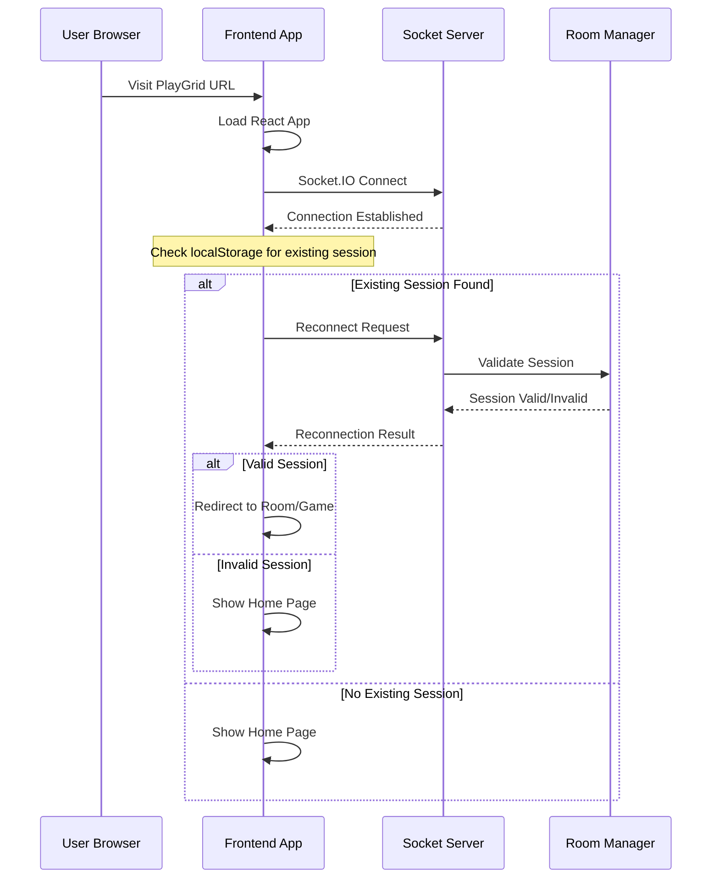

### 2. Room Creation Flow

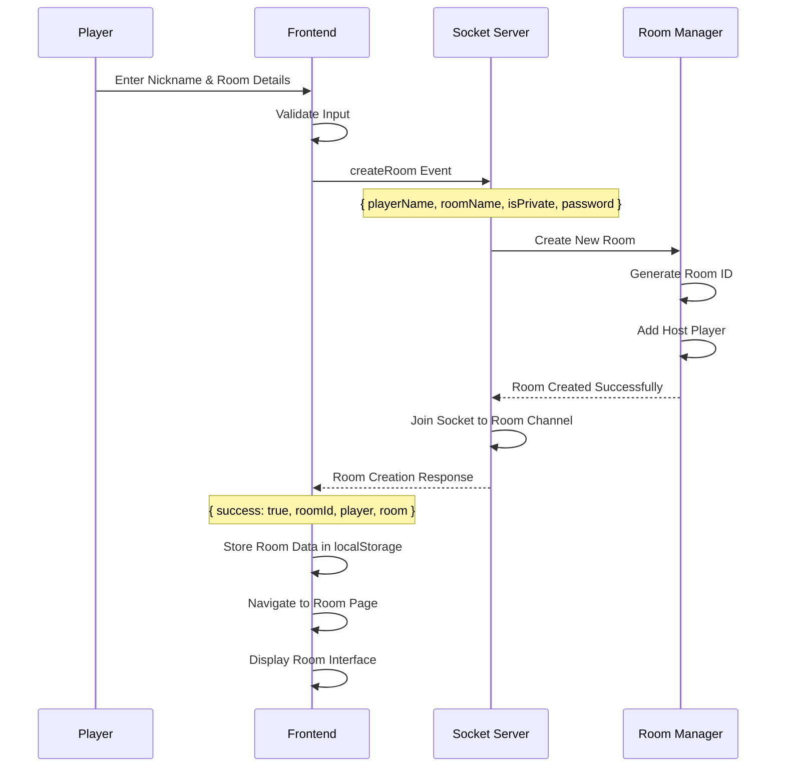

### 3. Room Joining Flow

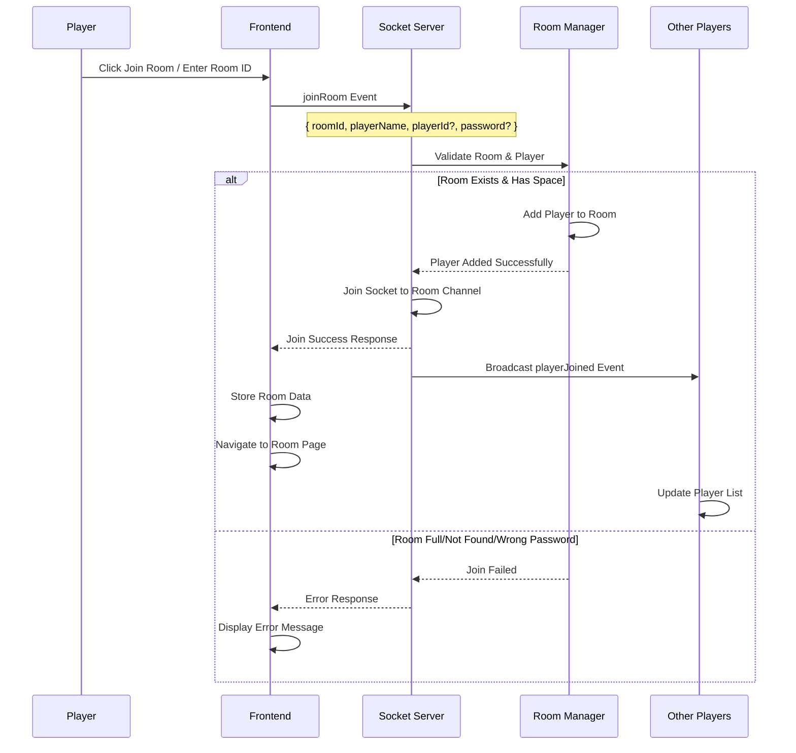

### 4. Game Initialization Flow

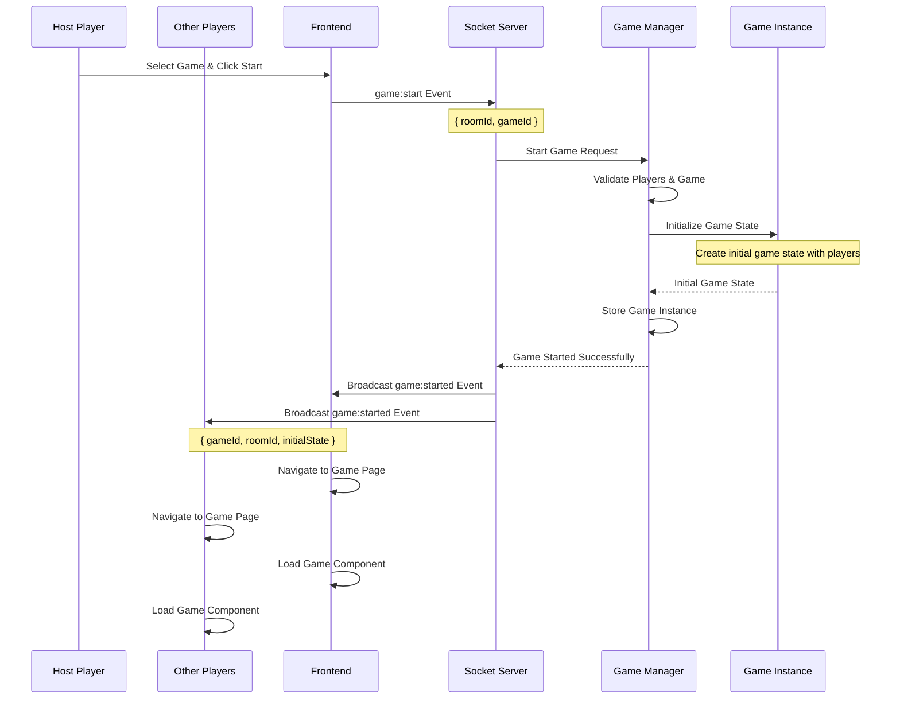

## 🃏 Coup Game Flow Example

### Game Setup & Initial State

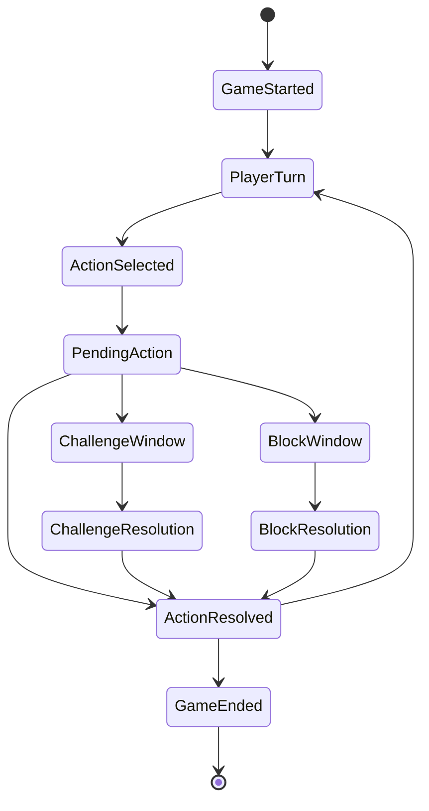

### Detailed Coup Action Flow

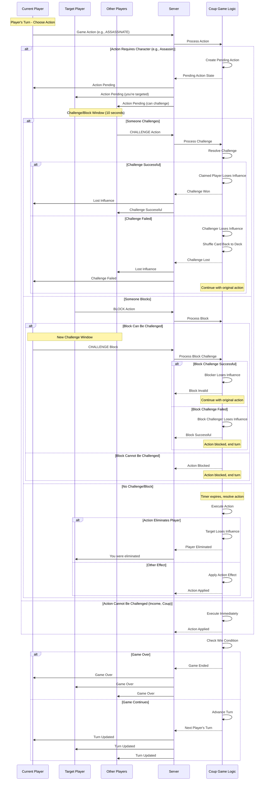

### Coup Card Loss Flow

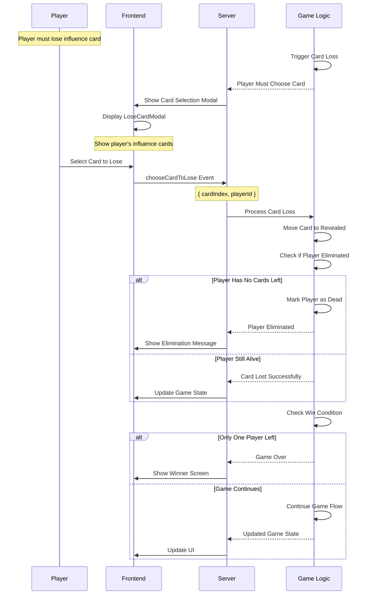

## 🎲 Turn Management System

### Turn Progression Logic

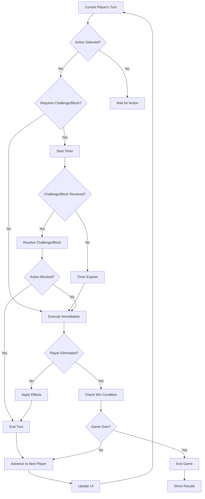

### Timer Management

**Challenge/Block Windows:**
```typescript
// 10-second window for challenges/blocks
const CHALLENGE_WINDOW_MS = 10000;

// Server-side timer management
function startChallengeTimer(roomId: string, actionId: string) {
    const timer = setTimeout(() => {
        resolveAction(roomId, actionId);
    }, CHALLENGE_WINDOW_MS);
    
    challengeTimers.set(actionId, timer);
}

function cancelChallengeTimer(actionId: string) {
    const timer = challengeTimers.get(actionId);
    if (timer) {
        clearTimeout(timer);
        challengeTimers.delete(actionId);
    }
}
```

**Client-side countdown:**
```typescript
// Frontend countdown display
function useCountdown(initialSeconds: number) {
    const [seconds, setSeconds] = useState(initialSeconds);
    
    useEffect(() => {
        if (seconds > 0) {
            const timer = setTimeout(() => setSeconds(seconds - 1), 1000);
            return () => clearTimeout(timer);
        }
    }, [seconds]);
    
    return seconds;
}
```

## 🔄 Reconnection Flow

### Player Reconnection Process

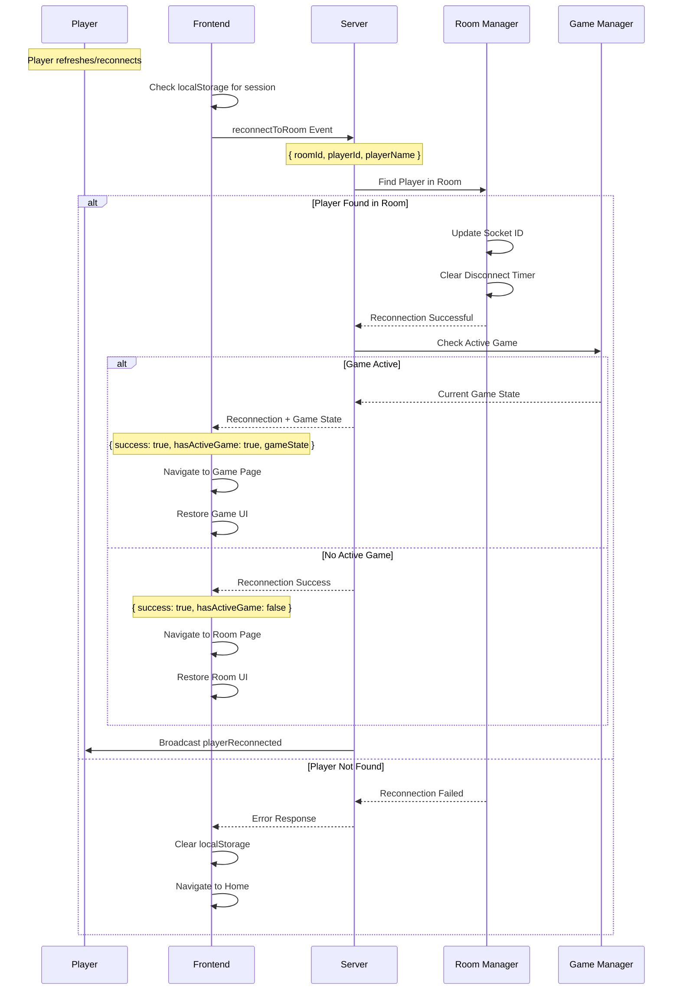

### Game State Synchronization

When a player reconnects mid-game:

```typescript
// Server sends complete game state
const gameState = gameManager.getGameState(roomId);
const playerState = gameState.players.find(p => p.playerId === playerId);

socket.emit('game:stateSync', {
    gameState,
    playerState,
    currentTurn: gameState.currentTurnPlayerId,
    pendingActions: gameState.pendingActions
});
```

```typescript
// Client receives and applies state
socket.on('game:stateSync', ({ gameState, playerState, currentTurn, pendingActions }) => {
    setGameState(gameState);
    setCurrentPlayer(playerState);
    setCurrentTurn(currentTurn);
    
    // Show any pending modals/actions
    if (pendingActions?.requiresPlayerChoice) {
        showPendingActionModal(pendingActions);
    }
});
```

## 📊 State Management Throughout Game Flow

### Client State Hierarchy

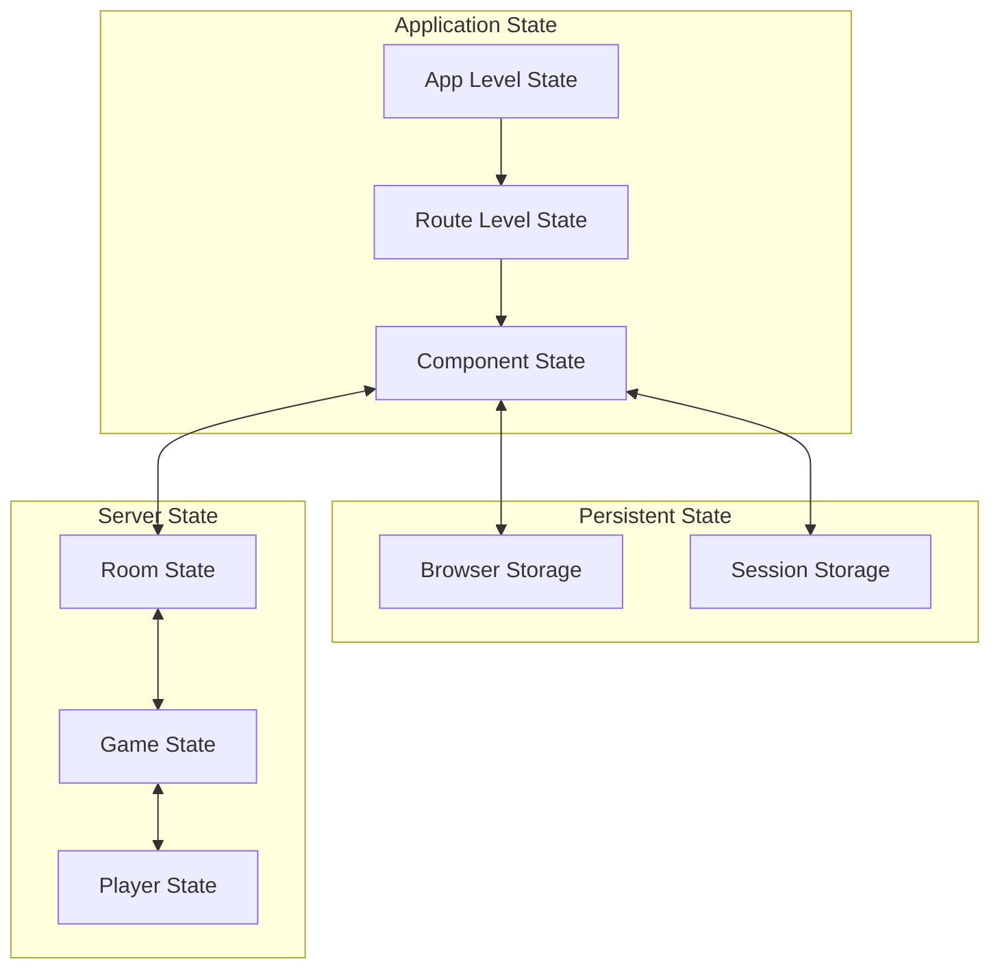

### State Synchronization Patterns

**Optimistic Updates:**
```typescript
// Immediate UI update, then sync with server
const handlePlayerAction = (action: GameAction) => {
    // 1. Optimistic update
    const newState = applyOptimisticUpdate(gameState, action);
    setGameState(newState);
    
    // 2. Send to server
    socket.emit('game:action', action);
    
    // 3. Server will send authoritative update
};

socket.on('game:stateUpdate', (authoritativeState) => {
    // Always trust server state
    setGameState(authoritativeState);
});
```

**Conflict Resolution:**
```typescript
// Handle state conflicts gracefully
socket.on('game:actionRejected', ({ reason, currentState }) => {
    // Revert optimistic update
    setGameState(currentState);
    
    // Show user-friendly error
    showNotification({
        type: 'error',
        message: getActionRejectionMessage(reason)
    });
});
```

## 🎮 Game-Specific Flow Variations

### Monopoly Game Flow (Planned)

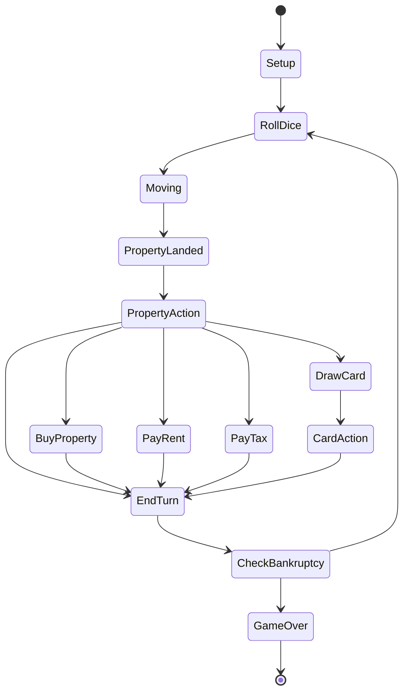

### Custom Game Integration

```typescript
// Game registration system
interface GameDefinition {
    gameId: string;
    name: string;
    minPlayers: number;
    maxPlayers: number;
    estimatedDuration: number;
    component: React.ComponentType<GameProps>;
    rules: GameRules;
}

// Register new games
const gameRegistry = new Map<string, GameDefinition>();

function registerGame(definition: GameDefinition) {
    gameRegistry.set(definition.gameId, definition);
}

// Dynamic game loading
async function loadGame(gameId: string) {
    const definition = gameRegistry.get(gameId);
    if (!definition) {
        throw new Error(`Game ${gameId} not found`);
    }
    
    return definition;
}
```

## 🚨 Error Handling & Edge Cases

### Network Disconnection Handling

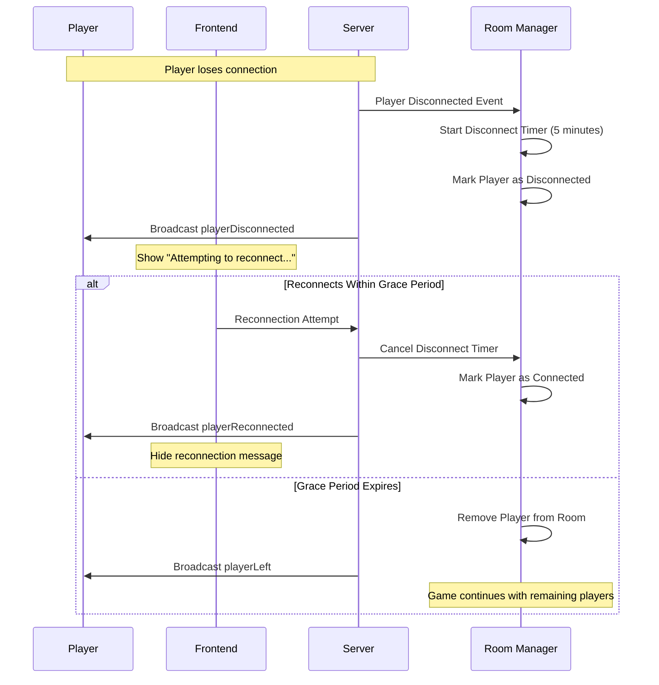

### Game State Corruption Recovery

```typescript
// Server-side validation and recovery
function validateGameState(state: GameState): boolean {
    // Validate player counts, card counts, etc.
    const isValid = checkPlayerIntegrity(state) && 
                   checkCardIntegrity(state) &&
                   checkTurnIntegrity(state);
    
    if (!isValid) {
        logStateCorruption(state);
        return false;
    }
    
    return true;
}

function recoverFromCorruption(roomId: string) {
    // Attempt to restore from last known good state
    const lastGoodState = getLastKnownGoodState(roomId);
    if (lastGoodState) {
        setGameState(roomId, lastGoodState);
        broadcastStateReset(roomId);
    } else {
        // Last resort: end game gracefully
        endGameWithError(roomId, "Game state corrupted");
    }
}
```

---

**Next: [Enhanced Setup Guide](./setup-guide.md)**