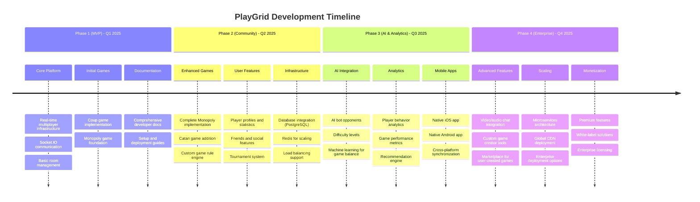
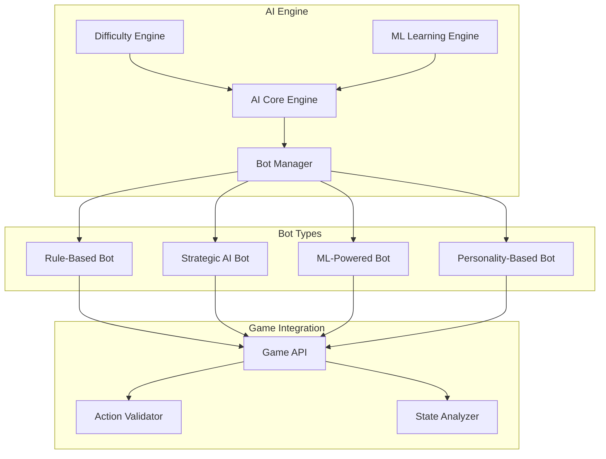

# 🔮 PlayGrid Roadmap & Future Enhancements

## Vision Statement

PlayGrid aims to become the premier open-source platform for digital board gaming, providing developers with the tools to create engaging multiplayer experiences and players with a comprehensive library of their favorite board games in a modern, accessible format.

## 🗺️ Development Roadmap



---

## 🎮 Game Development Roadmap

### Immediate Priorities (Phase 1)

**1. Complete Coup Implementation**
- [ ] Finish challenge and block mechanics
- [ ] Add card selection for exchange actions
- [ ] Implement advanced game variants
- [ ] Add spectator mode
- [ ] Create comprehensive tutorial

**2. Monopoly Development**
- [ ] Complete property trading system
- [ ] Implement chance and community chest cards
- [ ] Add house and hotel mechanics
- [ ] Create animated game board
- [ ] Add customizable house rules

### Short Term (Phase 2)

**3. Catan Implementation**
```typescript
interface CatanGameState {
  board: HexTile[];
  players: CatanPlayer[];
  robberPosition: number;
  diceRoll: [number, number];
  currentPhase: 'SETUP' | 'ROLLING' | 'TRADING' | 'BUILDING';
  devCards: DevelopmentCard[];
  longestRoad: string | null;
  largestArmy: string | null;
}

interface CatanPlayer {
  playerId: string;
  name: string;
  color: PlayerColor;
  resources: ResourceCards;
  settlements: Settlement[];
  cities: City[];
  roads: Road[];
  developmentCards: DevelopmentCard[];
  victoryPoints: number;
}
```

**4. Poker Implementation**
```typescript
interface PokerGameState {
  players: PokerPlayer[];
  communityCards: Card[];
  pot: number;
  currentBet: number;
  gamePhase: 'PREFLOP' | 'FLOP' | 'TURN' | 'RIVER' | 'SHOWDOWN';
  dealerPosition: number;
  actionOn: string;
}
```

**5. Risk Implementation**
```typescript
interface RiskGameState {
  territories: Territory[];
  players: RiskPlayer[];
  currentPhase: 'DEPLOY' | 'ATTACK' | 'FORTIFY';
  reinforcements: number;
  cards: RiskCard[];
}
```

### Medium Term (Phase 3)

**6. Custom Game Engine**
```typescript
interface GameDefinition {
  id: string;
  name: string;
  version: string;
  minPlayers: number;
  maxPlayers: number;
  estimatedDuration: number;
  components: GameComponent[];
  rules: GameRule[];
  actions: GameActionDefinition[];
  winConditions: WinCondition[];
}

interface GameComponent {
  type: 'board' | 'card' | 'token' | 'dice' | 'timer';
  id: string;
  properties: ComponentProperties;
  behaviors: ComponentBehavior[];
}
```

---

## 🤖 AI Integration Features

### AI Bot System Architecture



### AI Bot Implementation

**1. Basic Rule-Based Bots**
```typescript
class CoupBasicBot implements AIPlayer {
  calculateAction(gameState: CoupGameState, playerId: string): GameAction {
    const player = gameState.players.find(p => p.playerId === playerId);
    if (!player) throw new Error('Player not found');
    
    // Simple rule-based logic
    if (player.coins >= 7) {
      // Must coup someone
      const targets = gameState.players.filter(p => p.isAlive && p.playerId !== playerId);
      const target = targets[Math.floor(Math.random() * targets.length)];
      return { type: 'COUP', playerId, payload: { targetId: target.playerId } };
    }
    
    if (player.coins >= 3 && Math.random() > 0.7) {
      // Sometimes assassinate
      return { type: 'ASSASSINATE', playerId, payload: { targetId: this.selectTarget(gameState, playerId) } };
    }
    
    // Default to income
    return { type: 'INCOME', playerId };
  }
  
  private selectTarget(gameState: CoupGameState, playerId: string): string {
    const opponents = gameState.players.filter(p => p.isAlive && p.playerId !== playerId);
    // Target player with most cards or coins
    return opponents.reduce((prev, curr) => 
      (curr.influence.length + curr.coins) > (prev.influence.length + prev.coins) ? curr : prev
    ).playerId;
  }
}
```

**2. Strategic AI with Monte Carlo Tree Search**
```typescript
class CoupStrategicBot implements AIPlayer {
  private mcts: MonteCarloTreeSearch;
  
  constructor(difficulty: 'easy' | 'medium' | 'hard') {
    this.mcts = new MonteCarloTreeSearch({
      simulations: difficulty === 'easy' ? 100 : difficulty === 'medium' ? 500 : 1000,
      explorationConstant: 1.4
    });
  }
  
  calculateAction(gameState: CoupGameState, playerId: string): GameAction {
    const bestAction = this.mcts.search(gameState, playerId);
    return bestAction;
  }
}
```

**3. Machine Learning Bot**
```typescript
class CoupMLBot implements AIPlayer {
  private model: TensorFlowModel;
  
  async calculateAction(gameState: CoupGameState, playerId: string): Promise<GameAction> {
    const features = this.extractFeatures(gameState, playerId);
    const prediction = await this.model.predict(features);
    return this.convertPredictionToAction(prediction);
  }
  
  private extractFeatures(gameState: CoupGameState, playerId: string): number[] {
    // Convert game state to feature vector
    return [
      // Player state features
      gameState.players.find(p => p.playerId === playerId)?.coins || 0,
      gameState.players.find(p => p.playerId === playerId)?.influence.length || 0,
      
      // Opponent features
      ...gameState.players
        .filter(p => p.playerId !== playerId)
        .flatMap(p => [p.coins, p.influence.length, p.isAlive ? 1 : 0]),
      
      // Game state features
      gameState.deck.length,
      gameState.pendingAction ? 1 : 0
    ];
  }
}
```

### AI Personality System

```typescript
interface AIPersonality {
  name: string;
  description: string;
  traits: PersonalityTraits;
  behaviors: BehaviorWeights;
}

interface PersonalityTraits {
  aggression: number;      // 0-1: How likely to attack/challenge
  risk_tolerance: number;  // 0-1: Willingness to take risks
  cooperation: number;     // 0-1: Likelihood to cooperate vs compete
  bluffing: number;       // 0-1: Frequency of bluffing
  adaptability: number;   // 0-1: How quickly they adapt strategy
}

const AI_PERSONALITIES: AIPersonality[] = [
  {
    name: "The Aggressive",
    description: "Plays aggressively and challenges frequently",
    traits: { aggression: 0.9, risk_tolerance: 0.8, cooperation: 0.2, bluffing: 0.7, adaptability: 0.6 }
  },
  {
    name: "The Calculator",
    description: "Makes careful, calculated moves",
    traits: { aggression: 0.3, risk_tolerance: 0.2, cooperation: 0.5, bluffing: 0.3, adaptability: 0.9 }
  },
  {
    name: "The Trickster",
    description: "Loves to bluff and misdirect",
    traits: { aggression: 0.6, risk_tolerance: 0.7, cooperation: 0.3, bluffing: 0.9, adaptability: 0.8 }
  }
];
```

---

## 🏆 Leaderboards & Statistics System

### Player Statistics Schema

```typescript
interface PlayerProfile {
  playerId: string;
  username: string;
  email?: string;
  avatar?: string;
  createdAt: Date;
  lastActive: Date;
  preferences: PlayerPreferences;
  statistics: PlayerStatistics;
}

interface PlayerStatistics {
  overall: OverallStats;
  gameStats: Map<string, GameSpecificStats>;
  achievements: Achievement[];
  rankHistory: RankEntry[];
}

interface OverallStats {
  gamesPlayed: number;
  gamesWon: number;
  winRate: number;
  totalPlayTime: number;
  averageGameDuration: number;
  currentRank: PlayerRank;
  peakRank: PlayerRank;
  rankPoints: number;
}

interface GameSpecificStats {
  gameId: string;
  gamesPlayed: number;
  wins: number;
  losses: number;
  winRate: number;
  averageScore: number;
  bestScore: number;
  gameSpecificMetrics: Record<string, number>;
}
```

### Ranking System

```typescript
class EloRankingSystem {
  private K_FACTOR = 32;
  
  calculateNewRatings(
    playerRating: number,
    opponentRatings: number[],
    playerPlacement: number,
    totalPlayers: number
  ): number {
    // Multi-player Elo calculation
    const expectedScore = this.calculateExpectedScore(playerRating, opponentRatings);
    const actualScore = this.placementToScore(playerPlacement, totalPlayers);
    
    return playerRating + this.K_FACTOR * (actualScore - expectedScore);
  }
  
  private calculateExpectedScore(playerRating: number, opponentRatings: number[]): number {
    return opponentRatings.reduce((sum, opponentRating) => {
      return sum + 1 / (1 + Math.pow(10, (opponentRating - playerRating) / 400));
    }, 0) / opponentRatings.length;
  }
  
  private placementToScore(placement: number, totalPlayers: number): number {
    // Convert placement (1st, 2nd, etc.) to score between 0 and 1
    return (totalPlayers - placement) / (totalPlayers - 1);
  }
}
```

### Achievement System

```typescript
interface Achievement {
  id: string;
  name: string;
  description: string;
  category: AchievementCategory;
  rarity: 'common' | 'rare' | 'epic' | 'legendary';
  criteria: AchievementCriteria;
  reward: AchievementReward;
  unlockedAt?: Date;
}

const ACHIEVEMENTS: Achievement[] = [
  {
    id: 'coup_first_win',
    name: 'First Blood',
    description: 'Win your first Coup game',
    category: 'GAME_SPECIFIC',
    rarity: 'common',
    criteria: { gameId: 'coup', wins: 1 },
    reward: { type: 'AVATAR', id: 'coup_winner' }
  },
  {
    id: 'coup_perfect_game',
    name: 'Untouchable',
    description: 'Win a Coup game without losing any influence',
    category: 'GAME_SPECIFIC',
    rarity: 'epic',
    criteria: { gameId: 'coup', perfectGame: true },
    reward: { type: 'TITLE', id: 'the_untouchable' }
  },
  {
    id: 'social_butterfly',
    name: 'Social Butterfly',
    description: 'Play games with 100 different players',
    category: 'SOCIAL',
    rarity: 'rare',
    criteria: { uniqueOpponents: 100 },
    reward: { type: 'BADGE', id: 'social_butterfly' }
  }
];
```

---

## 🎪 Tournament System

### Tournament Types

**1. Bracket Tournaments**
```typescript
interface BracketTournament {
  id: string;
  name: string;
  gameId: string;
  format: 'single_elimination' | 'double_elimination';
  maxParticipants: number;
  entryFee?: number;
  prizePool: PrizeDistribution;
  schedule: TournamentSchedule;
  brackets: TournamentBracket[];
}

interface TournamentBracket {
  round: number;
  matches: TournamentMatch[];
}

interface TournamentMatch {
  id: string;
  players: string[];
  winner?: string;
  gameResults: GameResult[];
  scheduledTime: Date;
  status: 'pending' | 'in_progress' | 'completed';
}
```

**2. League Tournaments**
```typescript
interface LeagueTournament {
  id: string;
  name: string;
  gameId: string;
  duration: Duration;
  divisions: Division[];
  promotionRules: PromotionRule[];
  seasonRewards: SeasonReward[];
}

interface Division {
  name: string;
  level: number;
  players: LeaguePlayer[];
  maxPlayers: number;
}
```

**3. Daily/Weekly Challenges**
```typescript
interface Challenge {
  id: string;
  name: string;
  description: string;
  gameId: string;
  type: 'daily' | 'weekly' | 'special_event';
  objectives: ChallengeObjective[];
  rewards: ChallengeReward[];
  startTime: Date;
  endTime: Date;
}

interface ChallengeObjective {
  description: string;
  criteria: ObjectiveCriteria;
  progress: number;
  target: number;
  completed: boolean;
}
```

---

## 📱 Mobile Application Features

### Progressive Web App (PWA) Enhancements

**1. Offline Support**
```typescript
// Service Worker for offline functionality
class PlayGridServiceWorker {
  private cacheName = 'playgrid-v1';
  
  async install() {
    const cache = await caches.open(this.cacheName);
    await cache.addAll([
      '/',
      '/static/js/bundle.js',
      '/static/css/main.css',
      '/manifest.json'
    ]);
  }
  
  async fetch(request: Request): Promise<Response> {
    // Cache-first strategy for static assets
    if (request.url.includes('/static/')) {
      const cached = await caches.match(request);
      return cached || fetch(request);
    }
    
    // Network-first for API calls
    try {
      const response = await fetch(request);
      if (response.ok) {
        const cache = await caches.open(this.cacheName);
        cache.put(request, response.clone());
      }
      return response;
    } catch {
      return caches.match(request) || new Response('Offline');
    }
  }
}
```

**2. Push Notifications**
```typescript
interface NotificationService {
  subscribeToNotifications(): Promise<PushSubscription>;
  sendGameInvitation(playerId: string, gameDetails: GameInvitation): Promise<void>;
  sendTurnNotification(playerId: string, gameId: string): Promise<void>;
  sendTournamentUpdate(playerId: string, tournament: Tournament): Promise<void>;
}

class WebPushNotificationService implements NotificationService {
  async subscribeToNotifications(): Promise<PushSubscription> {
    const registration = await navigator.serviceWorker.ready;
    return registration.pushManager.subscribe({
      userVisibleOnly: true,
      applicationServerKey: this.urlBase64ToUint8Array(PUBLIC_VAPID_KEY)
    });
  }
  
  async sendTurnNotification(playerId: string, gameId: string): Promise<void> {
    const notification = {
      title: "It's your turn!",
      body: "Your opponents are waiting for you to make your move.",
      icon: "/icon-192x192.png",
      badge: "/badge-72x72.png",
      data: { gameId, type: 'turn_notification' },
      actions: [
        { action: 'play', title: 'Play Now', icon: '/play-icon.png' },
        { action: 'dismiss', title: 'Dismiss' }
      ]
    };
    
    await this.sendNotification(playerId, notification);
  }
}
```

### Native Mobile Apps

**React Native Architecture:**
```typescript
// Shared game logic between web and mobile
interface GameEngine {
  initializeGame(gameId: string, players: Player[]): GameState;
  processAction(action: GameAction, state: GameState): GameState;
  validateAction(action: GameAction, state: GameState): boolean;
}

// Platform-specific implementations
class MobileGameRenderer {
  renderGameBoard(gameState: GameState): React.ReactElement {
    return (
      <ScrollView>
        <GameBoard state={gameState} />
        <ActionPanel actions={this.getAvailableActions(gameState)} />
      </ScrollView>
    );
  }
  
  private getAvailableActions(gameState: GameState): GameAction[] {
    // Mobile-optimized action selection
    return gameState.availableActions.filter(action => 
      this.isMobileFriendly(action)
    );
  }
}
```

---

## 🔧 Advanced Platform Features

### Real-time Video/Audio Chat

```typescript
interface MediaService {
  initializeCall(roomId: string): Promise<MediaSession>;
  joinCall(sessionId: string): Promise<void>;
  toggleVideo(): Promise<void>;
  toggleAudio(): Promise<void>;
  shareScreen(): Promise<void>;
}

class WebRTCMediaService implements MediaService {
  private peerConnections: Map<string, RTCPeerConnection> = new Map();
  
  async initializeCall(roomId: string): Promise<MediaSession> {
    const localStream = await navigator.mediaDevices.getUserMedia({
      video: true,
      audio: true
    });
    
    // Set up WebRTC peer connections for each participant
    const session = new MediaSession(roomId, localStream);
    return session;
  }
  
  async createOffer(peerId: string): Promise<RTCSessionDescriptionInit> {
    const pc = this.peerConnections.get(peerId);
    if (!pc) throw new Error('Peer connection not found');
    
    const offer = await pc.createOffer();
    await pc.setLocalDescription(offer);
    return offer;
  }
}
```

### Custom Game Creator Tools

```typescript
interface GameCreator {
  createGameDefinition(): GameDefinition;
  addComponent(component: GameComponent): void;
  defineRule(rule: GameRule): void;
  setWinCondition(condition: WinCondition): void;
  testGame(players: TestPlayer[]): GameTestResult;
  publishGame(definition: GameDefinition): Promise<PublishedGame>;
}

class VisualGameCreator implements GameCreator {
  private definition: GameDefinition;
  private canvas: GameCanvas;
  
  addComponent(component: GameComponent): void {
    this.definition.components.push(component);
    this.canvas.renderComponent(component);
  }
  
  defineRule(rule: GameRule): void {
    // Visual rule builder interface
    this.definition.rules.push(rule);
    this.updateRuleVisualization();
  }
  
  async publishGame(definition: GameDefinition): Promise<PublishedGame> {
    // Validate game definition
    const validation = await this.validateDefinition(definition);
    if (!validation.isValid) {
      throw new Error(`Invalid game definition: ${validation.errors.join(', ')}`);
    }
    
    // Submit to marketplace
    return this.submitToMarketplace(definition);
  }
}
```

### Game Marketplace

```typescript
interface GameMarketplace {
  searchGames(criteria: SearchCriteria): Promise<GameListing[]>;
  purchaseGame(gameId: string, paymentMethod: PaymentMethod): Promise<PurchaseResult>;
  rateGame(gameId: string, rating: GameRating): Promise<void>;
  getRecommendations(playerId: string): Promise<GameListing[]>;
}

interface GameListing {
  id: string;
  name: string;
  description: string;
  creator: Creator;
  category: GameCategory;
  price: number;
  rating: number;
  downloads: number;
  screenshots: string[];
  tags: string[];
  compatibility: PlatformCompatibility;
}
```

---

## 📊 Analytics & Business Intelligence

### Player Behavior Analytics

```typescript
interface AnalyticsService {
  trackEvent(event: AnalyticsEvent): Promise<void>;
  getPlayerJourney(playerId: string): Promise<PlayerJourney>;
  getGameMetrics(gameId: string, timeRange: TimeRange): Promise<GameMetrics>;
  getRetentionAnalysis(cohort: PlayerCohort): Promise<RetentionData>;
}

interface GameMetrics {
  totalPlayers: number;
  activeUsers: {
    daily: number;
    weekly: number;
    monthly: number;
  };
  sessionMetrics: {
    averageDuration: number;
    averageGamesPerSession: number;
    bounceRate: number;
  };
  gameSpecificMetrics: {
    averageGameDuration: number;
    completionRate: number;
    dropoutPoints: DropoutAnalysis[];
  };
}

interface DropoutAnalysis {
  gamePhase: string;
  dropoutPercentage: number;
  commonReasons: string[];
  suggestedImprovements: string[];
}
```

### A/B Testing Framework

```typescript
interface ABTestService {
  createTest(test: ABTestDefinition): Promise<ABTest>;
  assignUserToVariant(userId: string, testId: string): Promise<TestVariant>;
  trackConversion(userId: string, testId: string, conversionEvent: string): Promise<void>;
  getTestResults(testId: string): Promise<ABTestResults>;
}

interface ABTestDefinition {
  name: string;
  description: string;
  hypothesis: string;
  variants: TestVariant[];
  targetAudience: AudienceCriteria;
  successMetrics: SuccessMetric[];
  duration: number;
  trafficAllocation: number;
}
```

---

## 🛡️ Security & Privacy Enhancements

### Advanced Security Features

**1. Anti-Cheat System**
```typescript
interface AntiCheatService {
  validateAction(action: GameAction, context: GameContext): Promise<ValidationResult>;
  detectAnomalousPatterns(playerId: string): Promise<AnomalyReport>;
  reportSuspiciousActivity(report: SuspiciousActivityReport): Promise<void>;
}

class BehaviorAnalysisAntiCheat implements AntiCheatService {
  async validateAction(action: GameAction, context: GameContext): Promise<ValidationResult> {
    const checks = [
      this.checkActionTiming(action, context),
      this.checkActionPattern(action, context.playerHistory),
      this.checkImpossibleActions(action, context.gameState)
    ];
    
    const results = await Promise.all(checks);
    return this.aggregateResults(results);
  }
  
  private async checkActionTiming(action: GameAction, context: GameContext): Promise<CheckResult> {
    // Detect suspiciously fast actions that might indicate automation
    const timeSinceLastAction = Date.now() - context.lastActionTime;
    if (timeSinceLastAction < this.MIN_HUMAN_REACTION_TIME) {
      return { passed: false, reason: 'Action too fast for human player' };
    }
    return { passed: true };
  }
}
```

**2. Privacy Protection**
```typescript
interface PrivacyService {
  anonymizePlayerData(playerId: string): Promise<void>;
  exportPlayerData(playerId: string): Promise<PlayerDataExport>;
  deletePlayerData(playerId: string): Promise<void>;
  getDataProcessingConsent(playerId: string): Promise<ConsentStatus>;
}

class GDPRCompliantPrivacyService implements PrivacyService {
  async exportPlayerData(playerId: string): Promise<PlayerDataExport> {
    const playerData = await this.gatherAllPlayerData(playerId);
    return {
      profile: playerData.profile,
      gameHistory: playerData.gameHistory,
      statistics: playerData.statistics,
      preferences: playerData.preferences,
      communicationHistory: this.anonymizeCommunications(playerData.communications)
    };
  }
  
  async anonymizePlayerData(playerId: string): Promise<void> {
    // Replace PII with anonymous identifiers while preserving game statistics
    await this.replacePersonalIdentifiers(playerId);
    await this.hashSensitiveData(playerId);
  }
}
```

---

## 📈 Business & Monetization Strategy

### Revenue Streams

**1. Premium Features**
```typescript
interface PremiumFeatures {
  unlimitedGames: boolean;
  priorityMatchmaking: boolean;
  customAvatars: boolean;
  advancedStatistics: boolean;
  tournamentAccess: boolean;
  adFreeExperience: boolean;
}

interface SubscriptionTier {
  name: string;
  price: number;
  currency: string;
  billing: 'monthly' | 'yearly';
  features: PremiumFeatures;
  trialPeriod?: number;
}

const SUBSCRIPTION_TIERS: SubscriptionTier[] = [
  {
    name: 'Basic',
    price: 0,
    currency: 'USD',
    billing: 'monthly',
    features: {
      unlimitedGames: false, // Limited to 10 games per day
      priorityMatchmaking: false,
      customAvatars: false,
      advancedStatistics: false,
      tournamentAccess: false,
      adFreeExperience: false
    }
  },
  {
    name: 'Premium',
    price: 4.99,
    currency: 'USD',
    billing: 'monthly',
    features: {
      unlimitedGames: true,
      priorityMatchmaking: true,
      customAvatars: true,
      advancedStatistics: true,
      tournamentAccess: true,
      adFreeExperience: true
    },
    trialPeriod: 7 // 7-day free trial
  }
];
```

**2. In-Game Cosmetics**
```typescript
interface CosmeticItem {
  id: string;
  name: string;
  description: string;
  type: 'avatar' | 'board_theme' | 'card_back' | 'animation' | 'sound_pack';
  rarity: 'common' | 'rare' | 'epic' | 'legendary';
  price: number;
  currency: 'coins' | 'premium_currency';
  unlockedBy?: 'achievement' | 'level' | 'purchase';
}

interface PlayerInventory {
  playerId: string;
  items: CosmeticItem[];
  currencies: {
    coins: number;
    premiumCurrency: number;
  };
  activeItems: {
    avatar: string;
    boardTheme: string;
    cardBack: string;
  };
}
```

---

## 🌐 Global Expansion & Localization

### Multi-Language Support

```typescript
interface LocalizationService {
  getSupportedLanguages(): Language[];
  translateText(key: string, language: string, variables?: Record<string, string>): string;
  translateGameContent(gameId: string, language: string): GameTranslation;
  getUserLanguagePreference(userId: string): string;
}

interface GameTranslation {
  gameId: string;
  language: string;
  gameTitle: string;
  rules: string;
  cardNames: Record<string, string>;
  actionDescriptions: Record<string, string>;
  uiElements: Record<string, string>;
}

const SUPPORTED_LANGUAGES = [
  { code: 'en', name: 'English', flag: '🇺🇸' },
  { code: 'es', name: 'Español', flag: '🇪🇸' },
  { code: 'fr', name: 'Français', flag: '🇫🇷' },
  { code: 'de', name: 'Deutsch', flag: '🇩🇪' },
  { code: 'pt', name: 'Português', flag: '🇧🇷' },
  { code: 'zh', name: '中文', flag: '🇨🇳' },
  { code: 'ja', name: '日本語', flag: '🇯🇵' },
  { code: 'ko', name: '한국어', flag: '🇰🇷' }
];
```

### Regional Adaptations

```typescript
interface RegionalSettings {
  region: string;
  currency: string;
  timezone: string;
  dateFormat: string;
  numberFormat: string;
  culturalAdaptations: CulturalAdaptation[];
}

interface CulturalAdaptation {
  feature: string;
  modification: string;
  reason: string;
}
```

---

## 📅 Implementation Timeline

### Quarterly Milestones

**Q1 2025: Foundation & Core Games**
- [ ] Complete documentation and developer onboarding
- [ ] Finish Coup implementation with all features
- [ ] Complete Monopoly basic gameplay
- [ ] Set up production deployment infrastructure
- [ ] Implement basic player profiles and statistics

**Q2 2025: Community & Social Features**
- [ ] Add Catan game implementation
- [ ] Implement friends system and social features
- [ ] Create tournament system (basic)
- [ ] Add AI bot opponents (basic difficulty levels)
- [ ] Implement leaderboards and ranking system

**Q3 2025: Mobile & Advanced Features**
- [ ] Launch PWA with offline support
- [ ] Develop React Native mobile apps
- [ ] Implement video/audio chat integration
- [ ] Add advanced AI with machine learning
- [ ] Create game analytics dashboard

**Q4 2025: Marketplace & Enterprise**
- [ ] Launch custom game creator tools
- [ ] Implement game marketplace
- [ ] Add enterprise deployment options
- [ ] Implement monetization features
- [ ] Launch white-label solutions

---

## 🤝 Community Contribution Opportunities

### How Contributors Can Help

**Game Development:**
- Implement new board games
- Create game variants and house rules
- Design game UI components
- Add game tutorials and guides

**Platform Development:**
- Improve real-time performance
- Add accessibility features
- Enhance mobile experience
- Implement security features

**AI & Analytics:**
- Train AI models for different games
- Create personality-based AI opponents
- Implement player behavior analytics
- Develop recommendation systems

**Community & Content:**
- Create documentation and tutorials
- Design marketing materials
- Moderate community forums
- Organize tournaments and events

### Contributor Recognition

```typescript
interface ContributorProfile {
  username: string;
  contributions: Contribution[];
  badges: ContributorBadge[];
  totalCommits: number;
  featuresImplemented: string[];
  bugsFixed: number;
  documentationContributions: number;
}

interface ContributorBadge {
  id: string;
  name: string;
  description: string;
  criteria: string;
  earnedAt: Date;
  rarity: 'bronze' | 'silver' | 'gold' | 'platinum';
}
```

---

**This roadmap represents our vision for PlayGrid's future. We welcome community input and contributions to help shape the platform's development. Join us in building the future of digital board gaming!**

**Next: [Enhanced Contribution Guide](../CONTRIBUTING.md)**