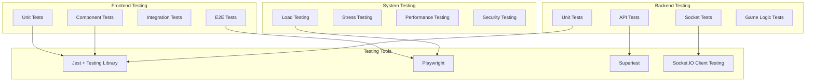

# 🧪 PlayGrid Testing Strategy

## Testing Overview

PlayGrid employs a comprehensive testing strategy that covers unit tests, integration tests, end-to-end tests, and real-time Socket.IO communication testing. This ensures the platform is reliable, performant, and provides a seamless multiplayer gaming experience.

## 🏗️ Testing Architecture



---

## 🎯 Testing Strategy by Layer

### 1. Unit Testing

**Frontend Unit Tests:**
```typescript
// components/__tests__/Button.test.tsx
import { render, screen, fireEvent } from '@testing-library/react';
import { Button } from '../Button';

describe('Button Component', () => {
  it('renders with correct text', () => {
    render(<Button variant="primary" size="md">Click me</Button>);
    expect(screen.getByText('Click me')).toBeInTheDocument();
  });

  it('applies correct CSS classes for variant and size', () => {
    render(<Button variant="primary" size="lg">Test</Button>);
    const button = screen.getByRole('button');
    
    expect(button).toHaveClass('bg-indigo-600');
    expect(button).toHaveClass('px-6');
    expect(button).toHaveClass('py-3');
  });

  it('calls onClick handler when clicked', () => {
    const handleClick = jest.fn();
    render(<Button variant="primary" size="md" onClick={handleClick}>Click</Button>);
    
    fireEvent.click(screen.getByRole('button'));
    expect(handleClick).toHaveBeenCalledTimes(1);
  });

  it('shows loading state correctly', () => {
    render(<Button variant="primary" size="md" loading>Loading</Button>);
    const button = screen.getByRole('button');
    
    expect(button).toBeDisabled();
    expect(screen.getByTestId('spinner')).toBeInTheDocument();
  });
});
```

**Backend Unit Tests:**
```typescript
// games/__tests__/CoupGame.test.ts
import { CoupGame } from '../coup/CoupGame';
import { GameAction } from '../IGame';

describe('CoupGame', () => {
  let game: CoupGame;
  let initialState: any;

  beforeEach(() => {
    game = new CoupGame();
    initialState = game.initGame('room1', [
      { playerId: '1', name: 'Player 1' },
      { playerId: '2', name: 'Player 2' }
    ]);
  });

  describe('initGame', () => {
    it('creates initial game state with correct structure', () => {
      expect(initialState).toEqual(
        expect.objectContaining({
          players: expect.arrayContaining([
            expect.objectContaining({
              playerId: '1',
              name: 'Player 1',
              coins: 2,
              influence: expect.arrayContaining([
                expect.stringMatching(/Duke|Assassin|Captain|Ambassador|Contessa/)
              ])
            })
          ]),
          currentTurnPlayerId: '1',
          deck: expect.arrayContaining([]),
          gamePhase: 'PLAYING'
        })
      );
    });

    it('gives each player 2 starting coins', () => {
      initialState.players.forEach((player: any) => {
        expect(player.coins).toBe(2);
      });
    });

    it('gives each player 2 influence cards', () => {
      initialState.players.forEach((player: any) => {
        expect(player.influence).toHaveLength(2);
      });
    });
  });

  describe('handleAction', () => {
    it('processes INCOME action correctly', () => {
      const action: GameAction = {
        type: 'INCOME',
        playerId: '1'
      };

      const newState = game.handleAction('room1', action, initialState);
      const player = newState.players.find((p: any) => p.playerId === '1');

      expect(player.coins).toBe(3); // Started with 2, gained 1
      expect(newState.currentTurnPlayerId).toBe('2'); // Turn advanced
    });

    it('processes COUP action correctly', () => {
      // Give player enough coins for coup
      initialState.players[0].coins = 7;
      
      const action: GameAction = {
        type: 'COUP',
        playerId: '1',
        payload: { targetId: '2' }
      };

      const newState = game.handleAction('room1', action, initialState);
      const actor = newState.players.find((p: any) => p.playerId === '1');
      const target = newState.players.find((p: any) => p.playerId === '2');

      expect(actor.coins).toBe(0); // Lost 7 coins
      expect(target.influence).toHaveLength(1); // Lost 1 influence
    });

    it('creates pending action for challengeable actions', () => {
      const action: GameAction = {
        type: 'TAX',
        playerId: '1'
      };

      const newState = game.handleAction('room1', action, initialState);

      expect(newState.pendingAction).toEqual({
        type: 'TAX',
        fromPlayerId: '1'
      });
    });
  });

  describe('validateAction', () => {
    it('validates COUP action requires 7 coins', () => {
      const action: GameAction = {
        type: 'COUP',
        playerId: '1',
        payload: { targetId: '2' }
      };

      // Player has only 2 coins
      expect(game.validateAction(action, initialState)).toBe(false);

      // Give player 7 coins
      initialState.players[0].coins = 7;
      expect(game.validateAction(action, initialState)).toBe(true);
    });

    it('validates player exists and is alive', () => {
      const action: GameAction = {
        type: 'INCOME',
        playerId: 'nonexistent'
      };

      expect(game.validateAction(action, initialState)).toBe(false);
    });
  });
});
```

### 2. Integration Testing

**API Integration Tests:**
```typescript
// __tests__/integration/rooms.test.ts
import request from 'supertest';
import { Server } from 'socket.io';
import { createServer } from 'http';
import { app } from '../../src/server';

describe('Room Management API', () => {
  let server: any;
  let io: Server;

  beforeAll(() => {
    server = createServer(app);
    io = new Server(server);
    server.listen();
  });

  afterAll(() => {
    server.close();
  });

  describe('Health Check', () => {
    it('should return 200 and status ok', async () => {
      const response = await request(server).get('/health');
      
      expect(response.status).toBe(200);
      expect(response.body).toEqual({ status: 'ok' });
    });
  });

  describe('Socket.IO Events', () => {
    it('should handle room creation flow', (done) => {
      const client = require('socket.io-client')('http://localhost:3000');
      
      client.on('connect', () => {
        client.emit('createRoom', {
          playerName: 'TestPlayer',
          roomName: 'TestRoom',
          isPrivate: false
        }, (response: any) => {
          expect(response.success).toBe(true);
          expect(response.roomId).toBeDefined();
          expect(response.player.name).toBe('TestPlayer');
          
          client.disconnect();
          done();
        });
      });
    });
  });
});
```

**Socket.IO Integration Tests:**
```typescript
// __tests__/integration/socket.test.ts
import { Server } from 'socket.io';
import { io as Client, Socket } from 'socket.io-client';
import { createServer } from 'http';
import { initSocket } from '../../src/socket';

describe('Socket.IO Integration', () => {
  let io: Server;
  let serverSocket: any;
  let clientSocket: Socket;
  let httpServer: any;

  beforeAll((done) => {
    httpServer = createServer();
    io = new Server(httpServer);
    initSocket(io);
    
    httpServer.listen(() => {
      const port = httpServer.address().port;
      clientSocket = Client(`http://localhost:${port}`);
      
      io.on('connection', (socket) => {
        serverSocket = socket;
      });
      
      clientSocket.on('connect', done);
    });
  });

  afterAll(() => {
    io.close();
    clientSocket.close();
    httpServer.close();
  });

  test('should create and join room successfully', (done) => {
    // First, create a room
    clientSocket.emit('createRoom', {
      playerName: 'Host',
      roomName: 'Test Room',
      isPrivate: false
    }, (createResponse: any) => {
      expect(createResponse.success).toBe(true);
      const roomId = createResponse.roomId;

      // Create second client to join the room
      const secondClient = Client(`http://localhost:${httpServer.address().port}`);
      
      secondClient.on('connect', () => {
        secondClient.emit('joinRoom', {
          roomId,
          playerName: 'Joiner'
        }, (joinResponse: any) => {
          expect(joinResponse.success).toBe(true);
          expect(joinResponse.room.players).toHaveLength(2);
          
          secondClient.close();
          done();
        });
      });
    });
  });

  test('should handle game start flow', (done) => {
    clientSocket.emit('createRoom', {
      playerName: 'GameHost',
      roomName: 'Game Room',
      isPrivate: false
    }, (response: any) => {
      const roomId = response.roomId;
      
      clientSocket.emit('game:start', {
        roomId,
        gameId: 'coup'
      });
      
      clientSocket.on('game:started', (gameData: any) => {
        expect(gameData.gameId).toBe('coup');
        expect(gameData.roomId).toBe(roomId);
        expect(gameData.state.players).toHaveLength(1);
        done();
      });
    });
  });
});
```

### 3. Component Testing

**React Component Integration Tests:**
```typescript
// pages/__tests__/Room.test.tsx
import { render, screen, waitFor } from '@testing-library/react';
import userEvent from '@testing-library/user-event';
import { BrowserRouter } from 'react-router-dom';
import { Room } from '../Room';
import { useSocket } from '../../hooks/useSocket';

// Mock socket hook
jest.mock('../../hooks/useSocket');
const mockUseSocket = useSocket as jest.MockedFunction<typeof useSocket>;

const mockSocket = {
  emit: jest.fn(),
  on: jest.fn(),
  off: jest.fn()
};

const MockWrapper = ({ children }: { children: React.ReactNode }) => (
  <BrowserRouter>{children}</BrowserRouter>
);

describe('Room Component', () => {
  beforeEach(() => {
    mockUseSocket.mockReturnValue(mockSocket as any);
    
    // Mock localStorage
    Object.defineProperty(window, 'localStorage', {
      value: {
        getItem: jest.fn().mockReturnValue('testPlayer'),
        setItem: jest.fn(),
        removeItem: jest.fn()
      },
      writable: true
    });
  });

  afterEach(() => {
    jest.clearAllMocks();
  });

  it('renders room interface correctly', () => {
    render(
      <MockWrapper>
        <Room />
      </MockWrapper>
    );

    expect(screen.getByText(/Room/)).toBeInTheDocument();
    expect(screen.getByText(/Players/)).toBeInTheDocument();
  });

  it('handles start game button click', async () => {
    const user = userEvent.setup();
    
    render(
      <MockWrapper>
        <Room />
      </MockWrapper>
    );

    const startButton = screen.getByRole('button', { name: /start game/i });
    await user.click(startButton);

    expect(mockSocket.emit).toHaveBeenCalledWith(
      'game:start',
      expect.objectContaining({
        gameId: expect.any(String)
      })
    );
  });

  it('displays error messages', async () => {
    render(
      <MockWrapper>
        <Room />
      </MockWrapper>
    );

    // Simulate error from socket
    const errorHandler = mockSocket.on.mock.calls.find(
      call => call[0] === 'errorMessage'
    )?.[1];

    if (errorHandler) {
      errorHandler('Test error message');
    }

    await waitFor(() => {
      expect(screen.getByText('Test error message')).toBeInTheDocument();
    });
  });
});
```

### 4. End-to-End Testing

**Playwright E2E Tests:**
```typescript
// e2e/gameplay.spec.ts
import { test, expect, Page } from '@playwright/test';

test.describe('PlayGrid Gameplay', () => {
  test('complete game flow from room creation to game end', async ({ page, context }) => {
    // Create a second page for second player
    const secondPage = await context.newPage();

    // Player 1: Create room
    await page.goto('http://localhost:5173');
    await page.fill('[data-testid="nickname-input"]', 'Player1');
    await page.click('[data-testid="enter-lobby-btn"]');
    
    await page.click('[data-testid="create-room-btn"]');
    await page.fill('[data-testid="room-name-input"]', 'Test Game Room');
    await page.click('[data-testid="create-btn"]');

    // Get room ID from URL
    await page.waitForURL(/\/room\/.+/);
    const roomId = page.url().split('/room/')[1];

    // Player 2: Join room
    await secondPage.goto('http://localhost:5173');
    await secondPage.fill('[data-testid="nickname-input"]', 'Player2');
    await secondPage.click('[data-testid="enter-lobby-btn"]');
    
    await secondPage.goto(`http://localhost:5173/room/${roomId}`);
    
    // Wait for both players to be in room
    await expect(page.locator('[data-testid="player-list"]')).toContainText('Player1');
    await expect(page.locator('[data-testid="player-list"]')).toContainText('Player2');
    await expect(secondPage.locator('[data-testid="player-list"]')).toContainText('Player1');
    await expect(secondPage.locator('[data-testid="player-list"]')).toContainText('Player2');

    // Player 1 (host): Start game
    await page.selectOption('[data-testid="game-select"]', 'coup');
    await page.click('[data-testid="start-game-btn"]');

    // Both players should be redirected to game
    await page.waitForURL(/\/game\/coup\/.+/);
    await secondPage.waitForURL(/\/game\/coup\/.+/);

    // Verify game UI is loaded
    await expect(page.locator('[data-testid="game-board"]')).toBeVisible();
    await expect(secondPage.locator('[data-testid="game-board"]')).toBeVisible();

    // Test basic game action
    await page.click('[data-testid="income-btn"]');
    
    // Verify action is processed
    await expect(page.locator('[data-testid="coin-count"]')).toContainText('3'); // Started with 2, gained 1
    
    // Verify turn advanced
    await expect(secondPage.locator('[data-testid="current-turn"]')).toContainText('Your turn');
  });

  test('reconnection after page refresh', async ({ page }) => {
    // Create room and start game
    await page.goto('http://localhost:5173');
    await page.fill('[data-testid="nickname-input"]', 'TestPlayer');
    await page.click('[data-testid="enter-lobby-btn"]');
    
    await page.click('[data-testid="create-room-btn"]');
    await page.fill('[data-testid="room-name-input"]', 'Reconnect Test');
    await page.click('[data-testid="create-btn"]');
    
    await page.selectOption('[data-testid="game-select"]', 'coup');
    await page.click('[data-testid="start-game-btn"]');
    
    await page.waitForURL(/\/game\/coup\/.+/);
    
    // Take an action to change game state
    await page.click('[data-testid="income-btn"]');
    await expect(page.locator('[data-testid="coin-count"]')).toContainText('3');
    
    // Refresh page to simulate disconnect
    await page.reload();
    
    // Should automatically reconnect and restore game state
    await page.waitForURL(/\/game\/coup\/.+/);
    await expect(page.locator('[data-testid="coin-count"]')).toContainText('3');
    await expect(page.locator('[data-testid="game-board"]')).toBeVisible();
  });
});
```

---

## 🔧 Test Configuration

### Jest Configuration

**jest.config.js (Backend):**
```javascript
module.exports = {
  preset: 'ts-jest',
  testEnvironment: 'node',
  roots: ['<rootDir>/src'],
  testMatch: [
    '**/__tests__/**/*.+(ts|tsx|js)',
    '**/*.(test|spec).+(ts|tsx|js)'
  ],
  transform: {
    '^.+\\.(ts|tsx)$': 'ts-jest'
  },
  coverageDirectory: 'coverage',
  collectCoverageFrom: [
    'src/**/*.{ts,tsx}',
    '!src/**/*.d.ts',
    '!src/index.ts'
  ],
  coverageReporters: ['text', 'lcov', 'html'],
  setupFilesAfterEnv: ['<rootDir>/src/__tests__/setup.ts'],
  testTimeout: 10000
};
```

**jest.config.js (Frontend):**
```javascript
module.exports = {
  testEnvironment: 'jsdom',
  setupFilesAfterEnv: ['<rootDir>/src/setupTests.ts'],
  moduleNameMapping: {
    '\\.(css|less|scss|sass)$': 'identity-obj-proxy',
    '\\.(jpg|jpeg|png|gif|eot|otf|webp|svg|ttf|woff|woff2|mp4|webm|wav|mp3|m4a|aac|oga)$': 'jest-transform-stub'
  },
  transform: {
    '^.+\\.(ts|tsx)$': 'ts-jest',
    '^.+\\.(js|jsx)$': 'babel-jest'
  },
  collectCoverageFrom: [
    'src/**/*.{ts,tsx}',
    '!src/**/*.d.ts',
    '!src/index.tsx',
    '!src/vite-env.d.ts'
  ],
  coverageThreshold: {
    global: {
      branches: 70,
      functions: 70,
      lines: 70,
      statements: 70
    }
  }
};
```

### Playwright Configuration

**playwright.config.ts:**
```typescript
import { defineConfig, devices } from '@playwright/test';

export default defineConfig({
  testDir: './e2e',
  fullyParallel: true,
  forbidOnly: !!process.env.CI,
  retries: process.env.CI ? 2 : 0,
  workers: process.env.CI ? 1 : undefined,
  reporter: 'html',
  use: {
    baseURL: 'http://localhost:5173',
    trace: 'on-first-retry',
    screenshot: 'only-on-failure',
    video: 'retain-on-failure'
  },
  projects: [
    {
      name: 'chromium',
      use: { ...devices['Desktop Chrome'] }
    },
    {
      name: 'firefox',
      use: { ...devices['Desktop Firefox'] }
    },
    {
      name: 'webkit',
      use: { ...devices['Desktop Safari'] }
    },
    {
      name: 'Mobile Chrome',
      use: { ...devices['Pixel 5'] }
    }
  ],
  webServer: [
    {
      command: 'npm run dev',
      cwd: './backend',
      port: 4000,
      reuseExistingServer: !process.env.CI
    },
    {
      command: 'npm run dev',
      cwd: './frontend',
      port: 5173,
      reuseExistingServer: !process.env.CI
    }
  ]
});
```

---

## 🚀 Performance Testing

### Load Testing with Artillery

**artillery.yml:**
```yaml
config:
  target: 'http://localhost:4000'
  phases:
    - duration: 60
      arrivalRate: 10
      name: "Warm up"
    - duration: 120
      arrivalRate: 50
      name: "Ramp up load"
    - duration: 180
      arrivalRate: 100
      name: "Sustained load"
  socketio:
    query:
      transport: websocket

scenarios:
  - name: "Socket.IO room creation and joining"
    weight: 70
    engine: socketio
    flow:
      - emit:
          channel: "createRoom"
          data:
            playerName: "Player{{ $randomString() }}"
            roomName: "Room{{ $randomString() }}"
            isPrivate: false
      - think: 2
      - emit:
          channel: "joinRoom"
          data:
            roomId: "{{ roomId }}"
            playerName: "Joiner{{ $randomString() }}"

  - name: "HTTP health checks"
    weight: 30
    flow:
      - get:
          url: "/health"
        expect:
          - statusCode: 200
          - hasProperty: "status"
```

### Stress Testing with Custom Scripts

**stress-test.js:**
```javascript
const io = require('socket.io-client');

const CONCURRENT_USERS = 100;
const ACTIONS_PER_USER = 50;

async function stressTest() {
  const clients = [];
  const promises = [];

  console.log(`Starting stress test with ${CONCURRENT_USERS} concurrent users`);

  for (let i = 0; i < CONCURRENT_USERS; i++) {
    const client = io('http://localhost:4000');
    clients.push(client);

    const promise = new Promise((resolve, reject) => {
      let actionsCompleted = 0;

      client.on('connect', () => {
        console.log(`Client ${i} connected`);
        
        // Create room
        client.emit('createRoom', {
          playerName: `StressUser${i}`,
          roomName: `StressRoom${i}`,
          isPrivate: false
        }, (response) => {
          if (response.success) {
            performGameActions(client, response.roomId);
          } else {
            reject(new Error(`Failed to create room for client ${i}`));
          }
        });
      });

      function performGameActions(socket, roomId) {
        const interval = setInterval(() => {
          if (actionsCompleted >= ACTIONS_PER_USER) {
            clearInterval(interval);
            socket.disconnect();
            resolve(actionsCompleted);
            return;
          }

          // Simulate game actions
          socket.emit('game:action', {
            roomId,
            gameId: 'coup',
            action: {
              type: 'INCOME',
              playerId: socket.id
            }
          });

          actionsCompleted++;
        }, 100 + Math.random() * 200); // Random interval between actions
      }

      client.on('error', reject);
    });

    promises.push(promise);
  }

  try {
    const results = await Promise.all(promises);
    console.log(`Stress test completed. Total actions: ${results.reduce((a, b) => a + b, 0)}`);
  } catch (error) {
    console.error('Stress test failed:', error);
  }
}

stressTest();
```

---

## 📊 Test Coverage and Metrics

### Coverage Configuration

**package.json scripts:**
```json
{
  "scripts": {
    "test": "jest",
    "test:watch": "jest --watch",
    "test:coverage": "jest --coverage",
    "test:ci": "jest --coverage --watchAll=false",
    "test:integration": "jest --testMatch='**/*.integration.test.*'",
    "test:e2e": "playwright test",
    "test:load": "artillery run artillery.yml",
    "test:all": "npm run test && npm run test:e2e"
  }
}
```

### Coverage Reports

**GitHub Actions Integration:**
```yaml
name: Test Coverage
on: [push, pull_request]

jobs:
  test:
    runs-on: ubuntu-latest
    steps:
      - uses: actions/checkout@v3
      - uses: actions/setup-node@v3
        with:
          node-version: '20'
          
      - name: Install dependencies
        run: |
          cd backend && npm ci
          cd ../frontend && npm ci
          
      - name: Run backend tests with coverage
        run: cd backend && npm run test:ci
        
      - name: Run frontend tests with coverage
        run: cd frontend && npm run test:ci
        
      - name: Upload coverage to Codecov
        uses: codecov/codecov-action@v3
        with:
          directory: ./backend/coverage
          flags: backend
          
      - name: Upload frontend coverage
        uses: codecov/codecov-action@v3
        with:
          directory: ./frontend/coverage
          flags: frontend
```

---

## 🔍 Testing Best Practices

### 1. Test Structure (AAA Pattern)
```typescript
describe('Feature', () => {
  it('should behave correctly when condition is met', () => {
    // Arrange
    const input = 'test input';
    const expectedOutput = 'expected result';
    
    // Act
    const result = functionUnderTest(input);
    
    // Assert
    expect(result).toBe(expectedOutput);
  });
});
```

### 2. Mock Strategy
```typescript
// Mock external dependencies
jest.mock('../services/socket', () => ({
  createRoom: jest.fn(),
  joinRoom: jest.fn()
}));

// Mock React hooks
jest.mock('react-router-dom', () => ({
  ...jest.requireActual('react-router-dom'),
  useNavigate: jest.fn()
}));
```

### 3. Test Data Factories
```typescript
// __tests__/factories/gameState.ts
export function createMockCoupGameState(overrides = {}) {
  return {
    players: [
      {
        playerId: '1',
        name: 'Player 1',
        coins: 2,
        influence: ['Duke', 'Assassin'],
        revealedCards: [],
        isAlive: true
      }
    ],
    currentTurnPlayerId: '1',
    deck: ['Captain', 'Ambassador', 'Contessa'],
    gamePhase: 'PLAYING',
    ...overrides
  };
}
```

### 4. Custom Test Utilities
```typescript
// __tests__/utils/testUtils.tsx
import { render } from '@testing-library/react';
import { BrowserRouter } from 'react-router-dom';

export function renderWithRouter(component: React.ReactElement) {
  return render(
    <BrowserRouter>
      {component}
    </BrowserRouter>
  );
}

export function createMockSocket() {
  return {
    emit: jest.fn(),
    on: jest.fn(),
    off: jest.fn(),
    disconnect: jest.fn(),
    connected: true,
    id: 'mock-socket-id'
  };
}
```

---

## 📋 Testing Checklist

### Pre-Release Testing
- [ ] All unit tests passing
- [ ] Integration tests covering critical paths
- [ ] E2E tests for complete user journeys
- [ ] Socket.IO connection and reconnection tests
- [ ] Game logic validation tests
- [ ] Performance tests under expected load
- [ ] Cross-browser compatibility tests
- [ ] Mobile responsiveness tests
- [ ] Accessibility tests

### Manual Testing Scenarios
- [ ] Create room with various configurations
- [ ] Join room as multiple players
- [ ] Start game with minimum/maximum players
- [ ] Complete full game scenarios
- [ ] Test disconnection/reconnection
- [ ] Test simultaneous actions
- [ ] Test error scenarios (network issues, invalid actions)
- [ ] Test on different devices and browsers

---

**Next: [Future Enhancements](../roadmap.md)**